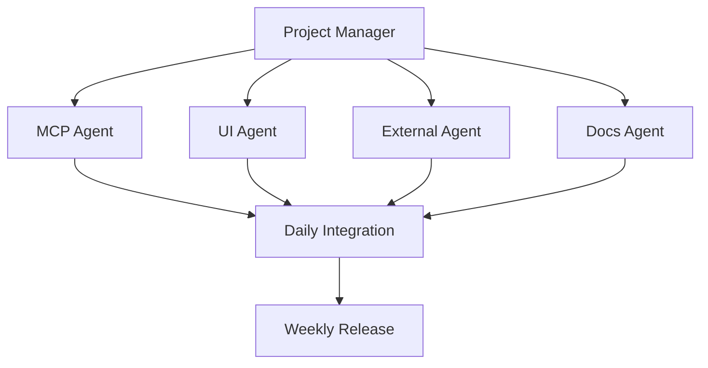

# Agent Parallelization Guide for Love Claude Code Platform

## Overview

This guide explains how to use multiple Claude agents in parallel to accelerate development of the Love Claude Code platform. By dividing work across specialized agents, we can achieve 10-12x development velocity while maintaining quality and consistency.

## Agent Team Structure

### 12 Specialized Agent Teams

1. **MCP Infrastructure Agent**
   - Focus: L1/L2 MCP components
   - Skills: Security, networking, protocol implementation
   - Current: authenticated-tool-registry

2. **UI Primitives Agent**
   - Focus: Diagram visualization components
   - Skills: SVG/Canvas, interaction design, performance
   - Current: node-primitive, edge-primitive

3. **External Integration Agent**
   - Focus: NPM/Docker/API wrappers
   - Skills: Package management, containerization, API design
   - Current: external-construct-primitive

4. **Documentation Agent**
   - Focus: Markdown + website documentation sync
   - Skills: Technical writing, API documentation, tutorials
   - Continuous updates across all features

5. **Testing Agent**
   - Focus: Test suite implementation
   - Skills: Unit/integration/E2E testing, coverage analysis
   - Works alongside feature development

6. **Security Agent**
   - Focus: Security layers and validation
   - Skills: Authentication, encryption, vulnerability assessment
   - Reviews all components for security

7. **Performance Agent**
   - Focus: Monitoring and optimization
   - Skills: Profiling, metrics, optimization techniques
   - Continuous performance monitoring

8. **UX/Workflow Agent**
   - Focus: Construct creation UI/UX
   - Skills: React, user experience, workflow design
   - Current: Project creation dialog updates

9. **Enterprise Features Agent**
   - Focus: SSO, RBAC, governance
   - Skills: Enterprise integration, compliance
   - Planned for Phase 2

10. **Marketing/Content Agent**
    - Focus: Showcase and tutorials
    - Skills: Content creation, video production
    - Creates user-facing materials

11. **DevOps Agent**
    - Focus: CI/CD and deployment
    - Skills: Docker, Kubernetes, automation
    - Maintains build pipeline

12. **Community Agent**
    - Focus: Marketplace and collaboration
    - Skills: Community building, moderation
    - Planned for Phase 3

## Parallelization Strategy

### Work Distribution



### Communication Protocol

1. **Daily Sync (15 minutes)**
   ```
   - Progress update (2 min per agent)
   - Blockers identification
   - Integration dependencies
   - Next 24h plan
   ```

2. **Weekly Integration (2 hours)**
   ```
   - Code review and merge
   - Integration testing
   - Documentation review
   - Demo preparation
   ```

3. **Sprint Review (1 hour)**
   ```
   - Feature demonstration
   - Metrics review
   - Retrospective
   - Next sprint planning
   ```

## Implementation Guidelines

### Starting an Agent Session

```markdown
You are the [AGENT_TYPE] Agent for Love Claude Code Platform.

Your focus areas:
- [Primary responsibility]
- [Secondary responsibility]
- [Integration points]

Current sprint goal: [SPECIFIC_GOAL]

Dependencies:
- Input from: [OTHER_AGENTS]
- Output to: [OTHER_AGENTS]

Please work on: [SPECIFIC_TASK]
```

### Agent Handoff Protocol

When an agent completes a task:

1. **Update Status**
   ```markdown
   Task: [TASK_NAME]
   Status: COMPLETED
   Output: [FILE_PATHS]
   Tests: [TEST_PATHS]
   Docs: [DOC_PATHS]
   Next: [DEPENDENT_TASKS]
   ```

2. **Integration Checklist**
   - [ ] Code follows project standards
   - [ ] Tests pass with >95% coverage
   - [ ] Documentation updated
   - [ ] No breaking changes
   - [ ] Performance benchmarks met

3. **Handoff Message**
   ```markdown
   @NextAgent: [TASK_NAME] complete
   - Input available at: [PATH]
   - API changes: [YES/NO]
   - Breaking changes: [YES/NO]
   - Action needed: [SPECIFIC_ACTION]
   ```

## Quality Standards

### Code Quality
- TypeScript strict mode
- ESLint + Prettier compliance
- No any types without justification
- Comprehensive error handling

### Testing Standards
- Unit tests: >95% coverage
- Integration tests: Critical paths
- E2E tests: User workflows
- Performance tests: <100ms response

### Documentation Standards
- API documentation: 100% coverage
- Usage examples: Every public API
- Troubleshooting: Common issues
- Migration guides: Breaking changes

## Synchronization Points

### Critical Dependencies

```yaml
L1_MCP_Components:
  depends_on:
    - L0_MCP_Primitives
  blocks:
    - L2_MCP_Patterns
    
Diagram_Visualization:
  depends_on:
    - L0_Diagram_Primitives
  blocks:
    - Architecture_Visualizer
    
External_Integration:
  depends_on:
    - Security_Framework
  blocks:
    - Marketplace_Features
```

### Integration Schedule

| Day | Morning | Afternoon |
|-----|---------|-----------|
| Mon | Sprint planning | Agent work |
| Tue | Agent work | Daily sync |
| Wed | Agent work | Integration test |
| Thu | Agent work | Daily sync |
| Fri | Code review | Weekly demo |

## Conflict Resolution

### Code Conflicts
1. Agent with earlier timestamp takes precedence
2. Architectural decisions escalated to lead
3. Performance regressions block merge

### API Conflicts
1. Backward compatibility required
2. Deprecation notices for breaking changes
3. Migration period of 2 sprints

### Resource Conflicts
1. Critical path tasks get priority
2. Security fixes override features
3. User-facing bugs prioritized

## Performance Metrics

### Agent Productivity
- Story points per sprint: 40-50
- Code quality score: >8/10
- Documentation completeness: 100%
- Test coverage: >95%

### Integration Health
- Build success rate: >95%
- Integration test pass rate: 100%
- Merge conflict rate: <5%
- Rollback rate: <1%

### Platform Progress
- Features completed per sprint: 15-20
- Bug discovery rate: Decreasing
- Performance benchmarks: Improving
- User satisfaction: >4.5/5

## Best Practices

### Do's
- ✅ Small, focused commits
- ✅ Descriptive PR titles
- ✅ Update tests with code
- ✅ Document while coding
- ✅ Communicate blockers early

### Don'ts
- ❌ Large, monolithic PRs
- ❌ Skip tests "temporarily"
- ❌ Break existing APIs
- ❌ Ignore performance
- ❌ Work in isolation

## Tools and Resources

### Communication
- GitHub Issues: Task tracking
- PR Comments: Code review
- Slack/Discord: Real-time chat
- Video calls: Complex discussions

### Development
- VS Code: Shared settings
- ESLint: Code standards
- Jest/Vitest: Testing
- Storybook: Component docs

### Monitoring
- GitHub Actions: CI/CD
- Codecov: Coverage tracking
- Lighthouse: Performance
- Sentry: Error tracking

## Scaling Guidelines

### Adding New Agents
1. Define clear responsibility area
2. Identify dependencies
3. Create onboarding checklist
4. Assign mentor agent
5. Start with small tasks

### Splitting Agent Work
When an agent is overloaded:
1. Identify divisible tasks
2. Create sub-specialization
3. Define new interfaces
4. Handoff gradually

### Merging Agent Roles
When agents have low utilization:
1. Identify overlap areas
2. Combine related skills
3. Maintain specialization
4. Update documentation

## Emergency Procedures

### Critical Bug
1. Stop feature work
2. Assign to Security/Performance agent
3. Create hotfix branch
4. Fast-track review process
5. Deploy immediately

### Integration Failure
1. Rollback to last known good
2. Identify breaking change
3. Fix or revert
4. Add regression test
5. Document root cause

### Agent Unavailability
1. Reassign critical tasks
2. Document handoff
3. Prioritize blockers
4. Adjust sprint goals
5. Update timeline

---

## Conclusion

Agent parallelization enables rapid development while maintaining quality. Success depends on:
- Clear communication
- Defined responsibilities  
- Regular integration
- Quality standards
- Continuous improvement

By following this guide, we can achieve 10-12x development velocity and build Love Claude Code faster and better.