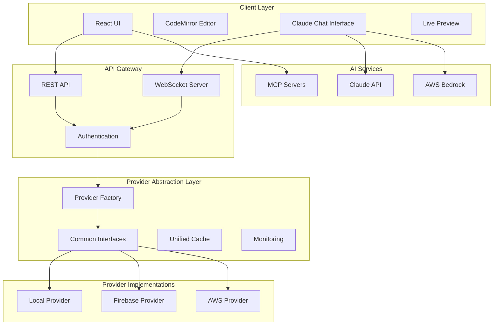
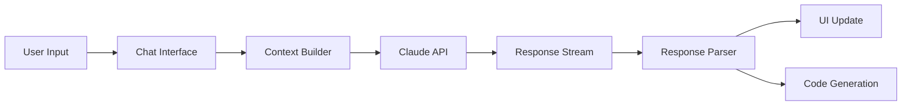
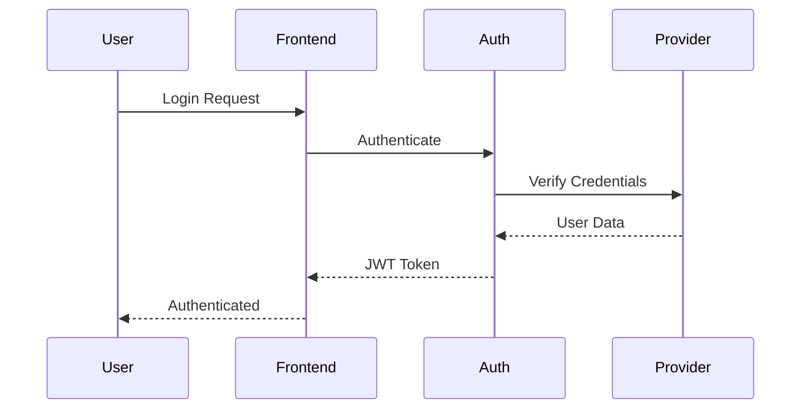
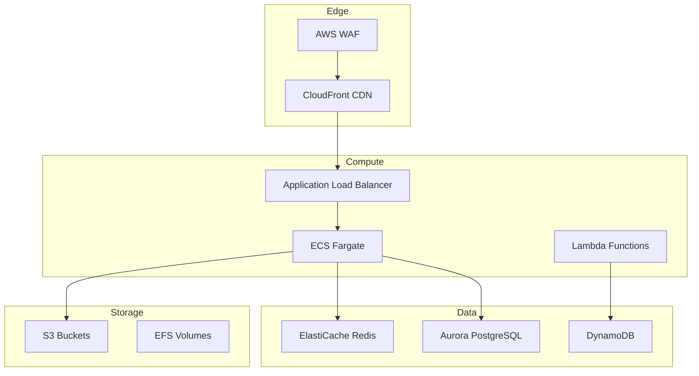
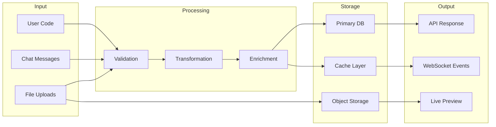
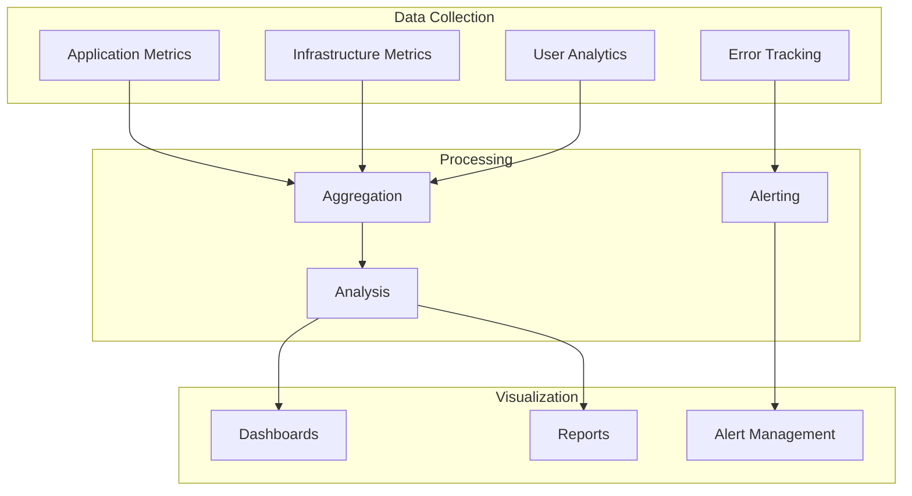

# Love Claude Code - System Architecture

## Overview

Love Claude Code is built on a modern, scalable architecture that separates concerns while maintaining high performance and developer experience. The system uses a multi-provider backend architecture that allows deployment across different cloud providers while maintaining a consistent API.

## High-Level Architecture



## Core Design Principles

### 1. Provider Abstraction
- **Single Interface**: All providers implement the same interface, ensuring code portability
- **Feature Parity**: Core features work identically across all providers
- **Graceful Degradation**: Optional features degrade gracefully if not supported

### 2. Separation of Concerns
- **Frontend**: Pure presentation and user interaction
- **Backend**: Business logic and data management
- **Providers**: Infrastructure-specific implementations
- **AI Layer**: Isolated AI integration with fallback options

### 3. Performance First
- **Lazy Loading**: Components and routes load on demand
- **Caching Strategy**: Multi-layer caching (browser, CDN, server, database)
- **Optimistic Updates**: UI updates before server confirmation
- **Streaming**: Real-time data via WebSockets and SSE

### 4. Security by Design
- **Zero Trust**: Every request is authenticated and authorized
- **Encryption**: Data encrypted at rest and in transit
- **Sandboxing**: User code execution in isolated containers
- **Rate Limiting**: API and resource usage limits

## Frontend Architecture

### Technology Stack
- **React 18.2+**: UI library with concurrent features
- **TypeScript 5.3+**: Type safety and better DX
- **Vite 5.0+**: Fast build tool and dev server
- **Zustand 4.0+**: Lightweight state management
- **CodeMirror 6.0+**: Extensible code editor
- **Tailwind CSS 3.4+**: Utility-first styling

### Component Structure
```
frontend/src/
├── components/           # Reusable UI components
│   ├── Editor/          # Code editor components
│   ├── Chat/            # AI chat interface
│   ├── Preview/         # Live preview system
│   └── Layout/          # Layout components
├── hooks/               # Custom React hooks
├── stores/              # Zustand state stores
├── services/            # API clients and external services
├── utils/               # Helper functions
└── types/               # TypeScript definitions
```

### State Management
We use Zustand for state management with the following stores:
- **editorStore**: Code editor state and file management
- **chatStore**: Conversation history and AI interactions
- **projectStore**: Project management and metadata
- **userPreferencesStore**: User settings and preferences
- **uiStore**: UI state (modals, panels, etc.)

### Performance Optimizations
1. **Code Splitting**: Routes and heavy components are lazy loaded
2. **Memoization**: Expensive computations are cached
3. **Virtual Scrolling**: Large lists use virtualization
4. **Web Workers**: Heavy processing offloaded to workers
5. **Asset Optimization**: Images and fonts are optimized

## Backend Architecture

### Multi-Provider Pattern

The backend uses a provider abstraction pattern that allows switching between different implementations:

```typescript
interface BackendProvider {
  type: ProviderType
  auth: AuthProvider
  database: DatabaseProvider
  storage: StorageProvider
  realtime: RealtimeProvider
  functions: FunctionProvider
  notifications?: NotificationProvider
}
```

### Provider Comparison

| Feature | Local | Firebase | AWS |
|---------|-------|----------|-----|
| **Authentication** | JWT | Firebase Auth | Cognito |
| **Database** | PostgreSQL/JSON | Firestore | DynamoDB |
| **File Storage** | File System | Cloud Storage | S3 |
| **Functions** | Node.js Process | Cloud Functions | Lambda |
| **Realtime** | WebSocket Server | Realtime DB | AppSync |
| **Scaling** | Manual | Automatic | Automatic |
| **Cost** | Free | Pay-as-you-go | Pay-as-you-go |

### Shared Services

All providers share common utilities:

1. **Caching Layer**
   - Redis for distributed cache
   - LRU for in-memory cache
   - Cache invalidation strategies

2. **Monitoring**
   - Unified metrics collection
   - Health checks
   - Performance tracking
   - Error reporting

3. **Resilience**
   - Circuit breakers
   - Retry logic
   - Bulkhead pattern
   - Timeout management

### API Design

#### REST API
- **Versioning**: `/api/v1/*` URL structure
- **Authentication**: Bearer token in Authorization header
- **Rate Limiting**: Token bucket algorithm
- **Pagination**: Cursor-based for scalability
- **Filtering**: Query parameter based

#### WebSocket Protocol
- **Connection**: Authenticated via token
- **Messages**: JSON with type field
- **Heartbeat**: Ping/pong every 30s
- **Reconnection**: Exponential backoff
- **Compression**: Per-message deflate

## AI Integration Architecture

### Claude Integration



### Hybrid Approach
1. **Development**: Direct Anthropic API
2. **Production**: AWS Bedrock for scale
3. **Fallback**: Graceful degradation if unavailable

### Context Management
- **Sliding Window**: Maintain relevant context
- **Token Optimization**: Smart truncation
- **Caching**: Cache common responses
- **Streaming**: Real-time response display

## Security Architecture

### Authentication Flow


### Security Layers
1. **Network Security**
   - HTTPS everywhere
   - CORS configuration
   - CSP headers
   - Rate limiting

2. **Application Security**
   - Input validation
   - SQL injection prevention
   - XSS protection
   - CSRF tokens

3. **Code Execution Security**
   - Docker containers
   - Resource limits
   - Network isolation
   - Temporary file systems

## Infrastructure Architecture

### Local Development
```yaml
services:
  frontend:
    - Vite dev server
    - Hot module replacement
  backend:
    - Node.js with nodemon
    - PostgreSQL database
    - Local file storage
  tools:
    - LocalStack (AWS emulation)
    - Firebase emulator
    - Redis container
```

### Production Deployment

#### AWS Architecture


### Scalability Considerations

1. **Horizontal Scaling**
   - Stateless services
   - Load balancing
   - Auto-scaling groups
   - Database read replicas

2. **Vertical Scaling**
   - Resource monitoring
   - Performance profiling
   - Optimization targets
   - Cost analysis

3. **Global Scale**
   - Multi-region deployment
   - Edge locations
   - Data replication
   - Latency optimization

## Data Architecture

### Data Flow


### Data Models

#### User Model
```typescript
interface User {
  id: string
  email: string
  profile: UserProfile
  settings: UserSettings
  subscription: Subscription
  createdAt: Date
  updatedAt: Date
}
```

#### Project Model
```typescript
interface Project {
  id: string
  userId: string
  name: string
  description: string
  provider: ProviderType
  files: FileTree
  settings: ProjectSettings
  collaborators: Collaborator[]
  createdAt: Date
  updatedAt: Date
}
```

#### File Model
```typescript
interface File {
  id: string
  projectId: string
  path: string
  content: string
  language: string
  version: number
  history: FileHistory[]
  createdAt: Date
  updatedAt: Date
}
```

## Performance Architecture

### Optimization Strategies

1. **Frontend Performance**
   - Bundle size optimization
   - Tree shaking
   - Lazy loading
   - Image optimization
   - Font subsetting

2. **Backend Performance**
   - Query optimization
   - N+1 query prevention
   - Connection pooling
   - Response compression
   - Caching strategies

3. **Network Performance**
   - CDN usage
   - HTTP/2 push
   - Preloading
   - Service workers
   - Offline support

### Monitoring & Observability



## Future Architecture Considerations

### Planned Improvements

1. **Microservices Migration**
   - Service decomposition
   - API gateway
   - Service mesh
   - Independent scaling

2. **Edge Computing**
   - Edge functions
   - Regional caching
   - Geo-distributed data
   - Latency optimization

3. **AI Enhancements**
   - Model fine-tuning
   - Custom embeddings
   - Semantic search
   - Code understanding

4. **Real-time Collaboration**
   - Operational Transformation
   - CRDT implementation
   - Presence awareness
   - Conflict resolution

### Technology Adoption

- **GraphQL**: For flexible data fetching
- **gRPC**: For internal service communication
- **Kubernetes**: For container orchestration
- **Istio**: For service mesh capabilities
- **OpenTelemetry**: For unified observability

## Conclusion

Love Claude Code's architecture is designed to be flexible, scalable, and maintainable. The multi-provider approach ensures that users can choose their preferred infrastructure while maintaining a consistent experience. The separation of concerns and abstraction layers make it easy to add new features and providers without affecting existing functionality.

The architecture prioritizes developer experience, performance, and security, ensuring that Love Claude Code can scale from individual developers to large teams while maintaining its core values of simplicity and power.