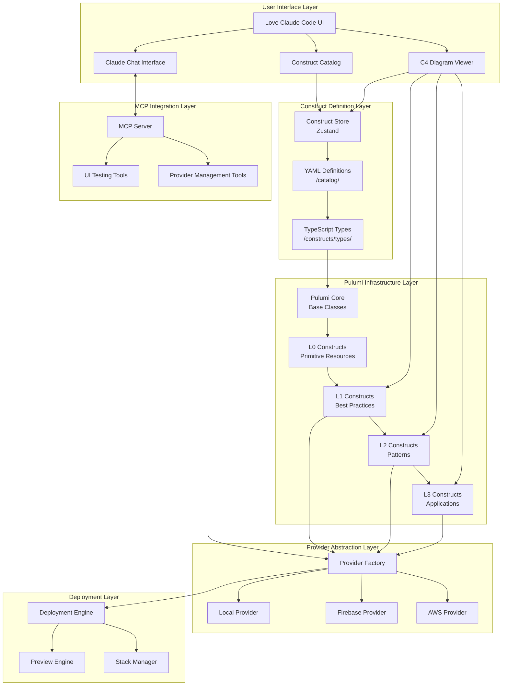
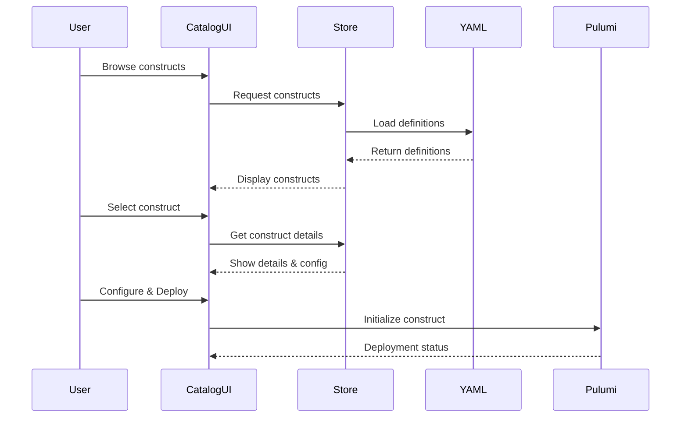
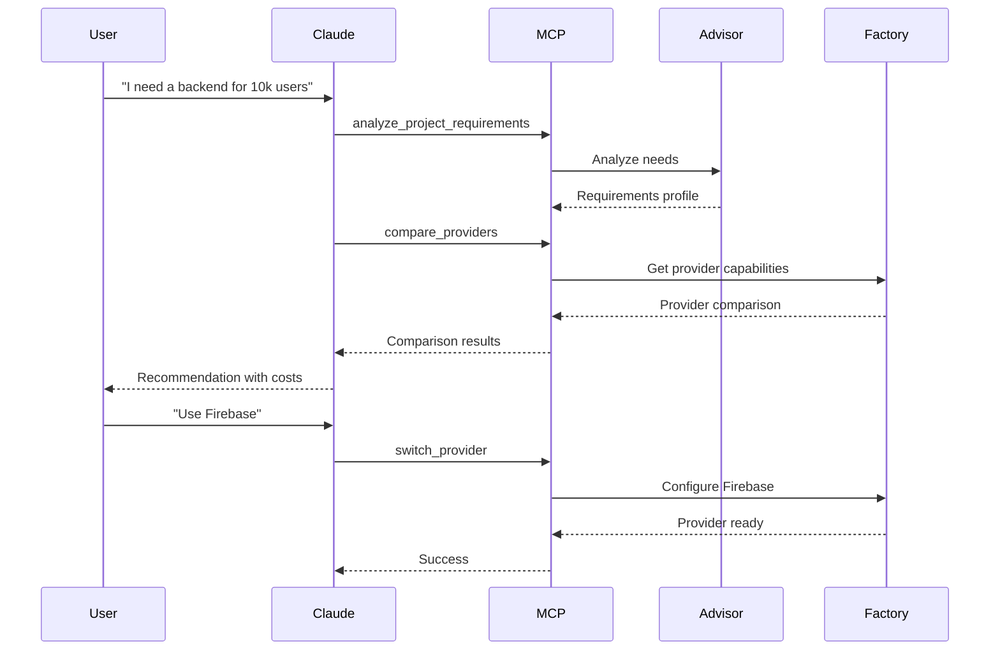
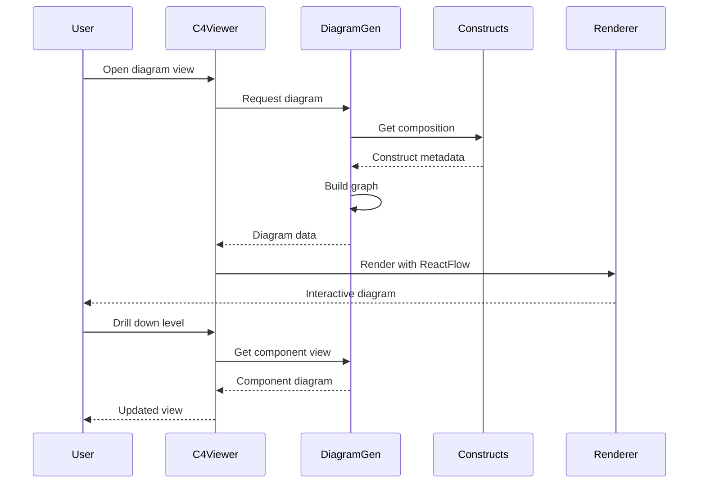
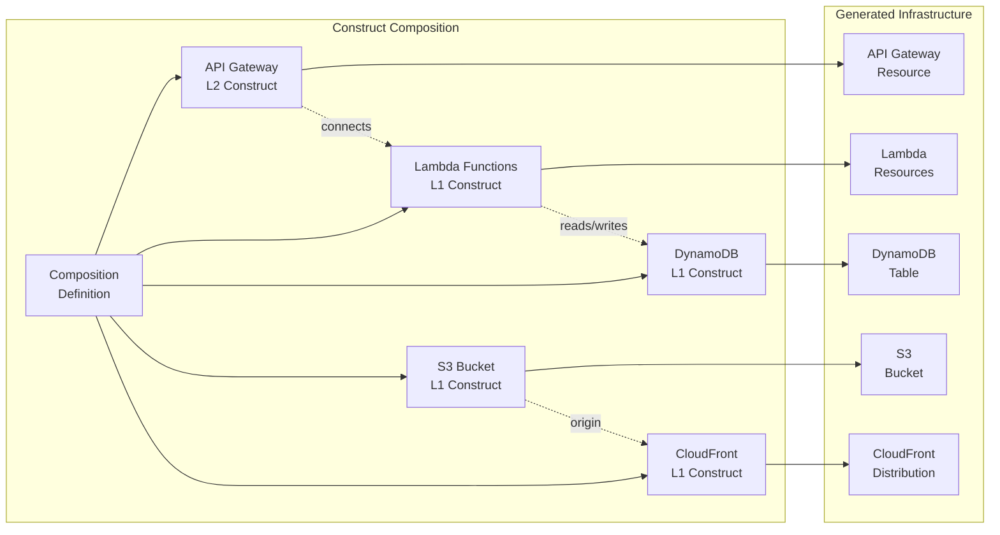
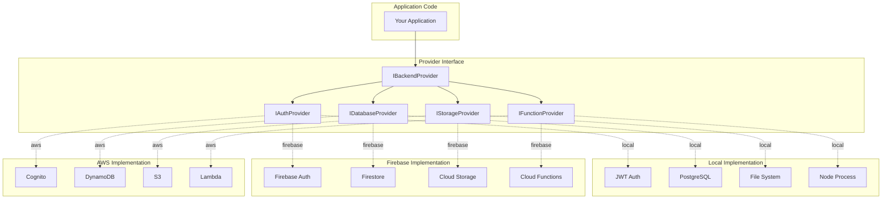
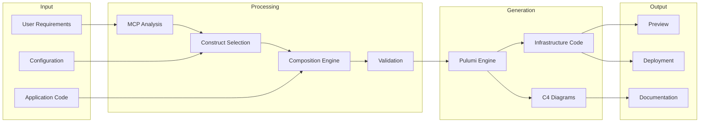
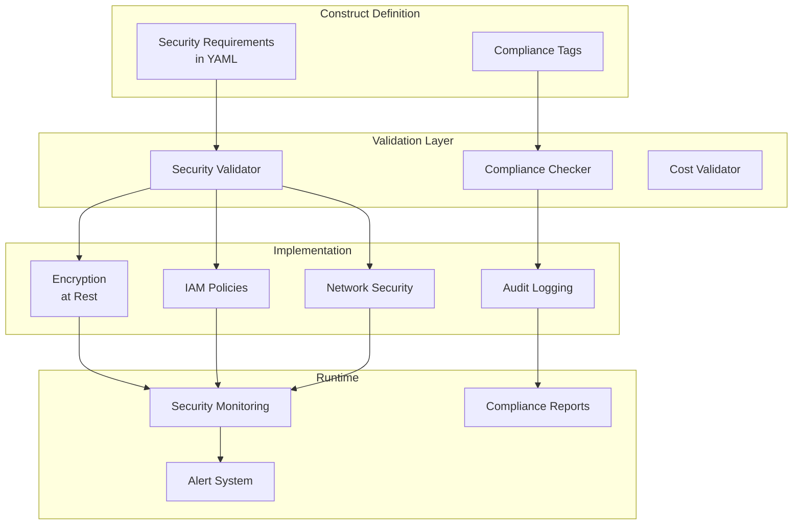
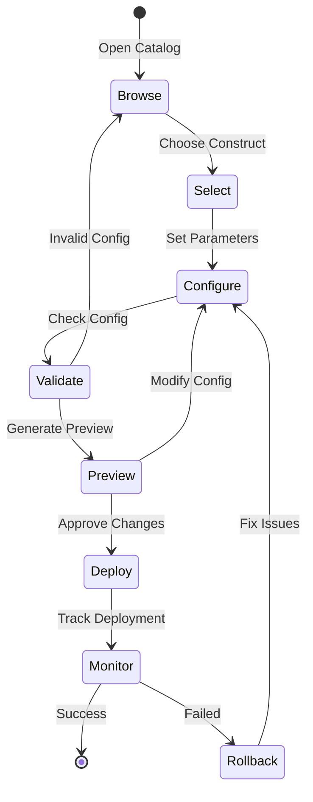

# Construct System Architecture Diagram

## High-Level Architecture Flow

## Detailed Component Interactions

### 1. Construct Selection Flow

### 2. MCP Provider Selection Flow

### 3. C4 Diagram Generation Flow

## Construct Composition Architecture

## Provider Abstraction Pattern

## Data Flow Through the System

## Security and Compliance Flow

## Development Workflow

This architecture demonstrates how Love Claude Code integrates:
- **Construct Catalog** for visual infrastructure selection
- **Pulumi** for infrastructure as code
- **MCP** for intelligent assistance
- **C4 Diagrams** for architecture visualization
- **Multi-Provider** support with consistent interfaces

The system is designed to be modular, extensible, and user-friendly while maintaining enterprise-grade capabilities.