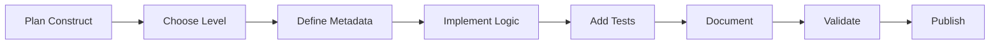

# Construct Development Guide

Welcome to the Love Claude Code Construct Development Guide! This comprehensive guide will walk you through creating, testing, and sharing constructs for the platform.

## Table of Contents

1. [Introduction](#introduction)
2. [Understanding Construct Levels](#understanding-construct-levels)
3. [Development Workflow](#development-workflow)
4. [Using the ConstructBuilder](#using-the-constructbuilder)
5. [Manual Construct Development](#manual-construct-development)
6. [Testing Your Constructs](#testing-your-constructs)
7. [Publishing to the Marketplace](#publishing-to-the-marketplace)
8. [Best Practices](#best-practices)
9. [Examples](#examples)

## Introduction

Love Claude Code uses a self-referential construct system where the platform builds itself using its own constructs. This creates a powerful ecosystem where every feature can be packaged, shared, and reused.

### What is a Construct?

A construct is a reusable building block that encapsulates functionality, configuration, and best practices. Constructs can range from simple UI components to complete application architectures.

### Why Create Constructs?

- **Reusability**: Write once, use everywhere
- **Standardization**: Enforce best practices across projects
- **Community**: Share your solutions with other developers
- **Self-Referential**: The platform itself is built from constructs

## Understanding Construct Levels

### L0 - Primitives (Foundation)

L0 constructs are the atomic building blocks - the simplest, most fundamental pieces that everything else builds upon.

**Characteristics:**
- No dependencies on other constructs
- Single responsibility
- Minimal configuration
- Maximum flexibility

**Examples:**
```typescript
// L0 UI Primitive
export class ButtonPrimitive extends L0UIConstruct {
  static metadata = {
    id: 'button-primitive',
    name: 'Button Primitive',
    description: 'Basic button component',
    categories: ['ui', 'interaction']
  }

  render() {
    return <button {...this.props}>{this.props.children}</button>
  }
}

// L0 Infrastructure Primitive
export class WebSocketPrimitive extends L0InfrastructureConstruct {
  constructor(url: string, options?: WebSocketOptions) {
    this.ws = new WebSocket(url)
    // Basic WebSocket setup
  }
}
```

### L1 - Components (Enhanced)

L1 constructs add configuration, security, and convenience features to L0 primitives.

**Characteristics:**
- Depends on 1-3 L0 constructs
- Adds security and best practices
- Configurable but opinionated
- Production-ready defaults

**Examples:**
```typescript
// L1 UI Component
export class SecureButton extends L1UIConstruct {
  static dependencies = ['button-primitive', 'auth-token-primitive']
  
  render() {
    return (
      <ButtonPrimitive
        onClick={this.handleSecureClick}
        disabled={!this.isAuthenticated}
      >
        {this.props.children}
      </ButtonPrimitive>
    )
  }
}

// L1 Infrastructure Component
export class AuthenticatedWebSocket extends L1InfrastructureConstruct {
  static dependencies = ['websocket-primitive', 'auth-service-primitive']
  
  constructor(config: AuthWebSocketConfig) {
    // Adds authentication, reconnection, encryption
  }
}
```

### L2 - Patterns (Solutions)

L2 constructs implement common architectural patterns and workflows.

**Characteristics:**
- Combines multiple L1 components
- Implements design patterns
- Solves specific use cases
- Often includes UI + Infrastructure

**Examples:**
```typescript
// L2 Pattern
export class RealTimeCollaboration extends L2PatternConstruct {
  static dependencies = [
    'authenticated-websocket',
    'secure-editor',
    'user-presence-ui'
  ]
  
  // Implements complete real-time collaboration
}
```

### L3 - Applications (Complete)

L3 constructs are full applications or major subsystems.

**Characteristics:**
- Combines multiple L2 patterns
- Complete, deployable solutions
- Includes all necessary components
- Ready to use out of the box

**Examples:**
```typescript
// L3 Application
export class LoveClaudeCodePlatform extends L3ApplicationConstruct {
  static dependencies = [
    'ide-workspace',
    'claude-conversation-system',
    'project-management-system',
    'deployment-pipeline'
  ]
  
  // Complete platform implementation
}
```

## Development Workflow

### 1. Choose Your Approach

#### Visual Development (Recommended for Beginners)
- Navigate to **Features → Construct Builder**
- Use the visual interface to create constructs
- Get real-time preview and validation
- Auto-generates TypeScript code

#### Manual Development (Advanced)
- Create TypeScript/TSX files directly
- Full control over implementation
- Use your favorite IDE
- Import existing constructs as dependencies

### 2. Development Process



## Using the ConstructBuilder

### Getting Started

1. **Open ConstructBuilder**
   ```
   Navigate to: Features → Construct Builder
   ```

2. **Create New Construct**
   - Click "New Construct"
   - Select construct level (L0-L3)
   - Choose category (UI, Infrastructure, Pattern, etc.)

### Visual Interface Features

#### Metadata Editor
- **Name**: Human-readable construct name
- **ID**: Unique identifier (auto-generated)
- **Description**: Clear explanation of purpose
- **Categories**: Tags for organization
- **Version**: Semantic versioning

#### Dependency Manager
- Search and add dependencies
- Visual dependency graph
- Automatic conflict resolution
- Version compatibility checking

#### Code Editor
- TypeScript with full IntelliSense
- Real-time syntax validation
- Import management
- Code formatting

#### Preview Panel
- Live preview for UI constructs
- Configuration testing
- Error display
- Performance metrics

### Example: Creating a Card Component

1. **Start New L0 Construct**
   ```
   Name: Card Primitive
   Category: UI
   Level: L0
   ```

2. **Add Implementation**
   ```typescript
   export class CardPrimitive extends L0UIConstruct {
     static metadata = {
       id: 'card-primitive',
       name: 'Card Primitive',
       description: 'Basic card container component',
       categories: ['ui', 'layout']
     }

     render() {
       const { className, children, ...props } = this.props
       return (
         <div 
           className={`card ${className || ''}`}
           {...props}
         >
           {children}
         </div>
       )
     }
   }
   ```

3. **Add Styles**
   ```css
   .card {
     background: white;
     border-radius: 8px;
     padding: 16px;
     box-shadow: 0 2px 4px rgba(0,0,0,0.1);
   }
   ```

4. **Test in Preview**
   - See live rendering
   - Try different props
   - Check responsive behavior

5. **Save and Validate**
   - Click "Validate Construct"
   - Fix any issues
   - Save to project

## Manual Construct Development

### File Structure

```
src/constructs/
├── L0/
│   ├── ui/
│   │   └── MyPrimitive.tsx
│   └── infrastructure/
│       └── MyService.ts
├── L1/
│   ├── ui/
│   │   └── MyComponent.tsx
│   └── infrastructure/
│       └── MyEnhancedService.ts
├── L2/
│   └── patterns/
│       └── MyPattern.tsx
└── L3/
    └── applications/
        └── MyApp.tsx
```

### Creating a Construct Manually

1. **Create the File**
   ```bash
   # For a new L0 UI primitive
   touch src/constructs/L0/ui/MyNewPrimitive.tsx
   ```

2. **Implement the Construct**
   ```typescript
   import React from 'react'
   import { L0UIConstruct } from '../../base/L0UIConstruct'
   import { ConstructMetadata } from '../../types'

   export class MyNewPrimitive extends L0UIConstruct {
     static metadata: ConstructMetadata = {
       id: 'my-new-primitive',
       name: 'My New Primitive',
       description: 'A new primitive construct',
       level: 'L0',
       categories: ['ui'],
       version: '1.0.0',
       author: 'Your Name'
     }

     render() {
       return <div>My New Primitive</div>
     }
   }

   // Export definition for registry
   export const myNewPrimitiveDefinition = MyNewPrimitive.metadata
   ```

3. **Register the Construct**
   ```typescript
   // In src/constructs/registry.ts
   import { myNewPrimitiveDefinition } from './L0/ui/MyNewPrimitive'

   // Add to imports section
   const RAW_CONSTRUCTS = [
     // ... existing constructs
     myNewPrimitiveDefinition
   ]
   ```

### Type Definitions

```typescript
interface ConstructMetadata {
  id: string
  name: string
  description: string
  level: 'L0' | 'L1' | 'L2' | 'L3'
  categories: string[]
  version: string
  author: string
  dependencies?: string[]
  providers?: ('local' | 'firebase' | 'aws')[]
  security?: SecurityFeature[]
  performance?: PerformanceMetrics
  selfReferential?: SelfReferentialMetadata
}

interface SelfReferentialMetadata {
  isPlatformConstruct: boolean
  constructDevelopmentMethod: 'manual' | 'ai-assisted' | 'visual-builder'
  vibeCodingPercentage?: number
  dependencies: string[]
}
```

## Testing Your Constructs

### Unit Tests

```typescript
// src/constructs/L0/ui/__tests__/MyNewPrimitive.test.tsx
import { render, screen } from '@testing-library/react'
import { MyNewPrimitive } from '../MyNewPrimitive'

describe('MyNewPrimitive', () => {
  it('renders correctly', () => {
    render(<MyNewPrimitive />)
    expect(screen.getByText('My New Primitive')).toBeInTheDocument()
  })

  it('accepts custom props', () => {
    render(<MyNewPrimitive className="custom" />)
    expect(screen.getByText('My New Primitive')).toHaveClass('custom')
  })
})
```

### Integration Tests

```typescript
// Test with dependencies
describe('L1 Component Integration', () => {
  it('integrates with L0 primitives', async () => {
    const component = new MyL1Component({
      dependencies: {
        'button-primitive': ButtonPrimitive,
        'auth-service': AuthService
      }
    })
    
    await component.initialize()
    expect(component.isReady).toBe(true)
  })
})
```

### Validation Tests

```typescript
// Automatic validation
import { ConstructValidator } from '../services/validation/ConstructValidator'

describe('Construct Validation', () => {
  it('passes validation', () => {
    const result = ConstructValidator.validate(
      MyNewPrimitive.metadata,
      'L0'
    )
    expect(result.valid).toBe(true)
    expect(result.errors).toHaveLength(0)
  })
})
```

## Publishing to the Marketplace

### Preparation Checklist

- [ ] Construct passes all tests
- [ ] Documentation is complete
- [ ] Examples are provided
- [ ] Version number is set
- [ ] Dependencies are declared
- [ ] License is specified

### Publishing Process

1. **Package Your Construct**
   ```bash
   npm run construct:package my-new-primitive
   ```

2. **Add Marketplace Metadata**
   ```typescript
   export const marketplaceMetadata = {
     ...MyNewPrimitive.metadata,
     screenshots: ['./screenshots/demo.png'],
     examples: ['./examples/basic.tsx'],
     documentation: './README.md',
     license: 'MIT',
     keywords: ['ui', 'primitive', 'card'],
     pricing: 'free' // or 'paid', 'freemium'
   }
   ```

3. **Submit for Review**
   - Go to Marketplace → Submit Construct
   - Upload package
   - Fill in additional details
   - Submit for review

4. **After Approval**
   - Construct appears in marketplace
   - Track usage statistics
   - Respond to user feedback
   - Release updates

## Best Practices

### General Guidelines

1. **Single Responsibility**
   - Each construct should do one thing well
   - Avoid feature creep

2. **Clear Naming**
   - Use descriptive, consistent names
   - Follow platform conventions

3. **Comprehensive Documentation**
   - Include usage examples
   - Document all props/options
   - Explain design decisions

4. **Error Handling**
   ```typescript
   try {
     // Construct logic
   } catch (error) {
     console.error(`[${this.metadata.id}] Error:`, error)
     // Graceful fallback
   }
   ```

5. **Performance Optimization**
   - Lazy load heavy dependencies
   - Use React.memo for UI components
   - Profile and optimize bottlenecks

### Level-Specific Guidelines

#### L0 Best Practices
- Keep it simple and focused
- No external dependencies
- Maximum flexibility
- Minimal opinions

#### L1 Best Practices
- Add security by default
- Provide sensible defaults
- Make common tasks easy
- Document configuration options

#### L2 Best Practices
- Solve real problems
- Include complete examples
- Consider multiple use cases
- Provide migration guides

#### L3 Best Practices
- Full documentation
- Deployment guides
- Configuration templates
- Support channels

## Examples

### Example 1: Toast Notification System (L1)

```typescript
// L1 UI Component combining multiple L0 primitives
export class ToastNotification extends L1UIConstruct {
  static metadata = {
    id: 'toast-notification',
    name: 'Toast Notification',
    description: 'Configurable toast notification system',
    level: 'L1',
    categories: ['ui', 'feedback'],
    dependencies: ['modal-primitive', 'button-primitive']
  }

  state = {
    toasts: []
  }

  show(message: string, type: 'info' | 'success' | 'error' = 'info') {
    const toast = {
      id: Date.now(),
      message,
      type,
      timestamp: new Date()
    }
    
    this.setState({
      toasts: [...this.state.toasts, toast]
    })

    // Auto-dismiss after 5 seconds
    setTimeout(() => this.dismiss(toast.id), 5000)
  }

  dismiss(id: number) {
    this.setState({
      toasts: this.state.toasts.filter(t => t.id !== id)
    })
  }

  render() {
    return (
      <div className="toast-container">
        {this.state.toasts.map(toast => (
          <motion.div
            key={toast.id}
            initial={{ opacity: 0, x: 100 }}
            animate={{ opacity: 1, x: 0 }}
            exit={{ opacity: 0, x: 100 }}
            className={`toast toast-${toast.type}`}
          >
            <span>{toast.message}</span>
            <ButtonPrimitive
              onClick={() => this.dismiss(toast.id)}
              className="toast-close"
            >
              ×
            </ButtonPrimitive>
          </motion.div>
        ))}
      </div>
    )
  }
}
```

### Example 2: API Client Pattern (L2)

```typescript
// L2 Pattern combining infrastructure and UI
export class APIClientPattern extends L2PatternConstruct {
  static metadata = {
    id: 'api-client-pattern',
    name: 'API Client Pattern',
    description: 'Complete API client with caching and UI',
    level: 'L2',
    categories: ['pattern', 'infrastructure', 'ui'],
    dependencies: [
      'authenticated-websocket',
      'rest-api-service',
      'loading-spinner',
      'error-boundary'
    ]
  }

  async initialize() {
    // Set up API client with authentication
    this.apiClient = new RestAPIService({
      baseURL: this.config.apiUrl,
      auth: this.dependencies['auth-service']
    })

    // Set up WebSocket for real-time updates
    this.ws = new AuthenticatedWebSocket({
      url: this.config.wsUrl,
      onMessage: this.handleRealtimeUpdate
    })

    // Initialize caching layer
    this.cache = new CacheManager({
      ttl: this.config.cacheTTL || 300
    })
  }

  // Fetch with caching and real-time updates
  async fetch(endpoint: string, options?: FetchOptions) {
    const cacheKey = `${endpoint}:${JSON.stringify(options)}`
    
    // Check cache first
    const cached = await this.cache.get(cacheKey)
    if (cached && !options?.skipCache) {
      return cached
    }

    try {
      const data = await this.apiClient.get(endpoint, options)
      await this.cache.set(cacheKey, data)
      return data
    } catch (error) {
      // Fallback to cache on error
      if (cached) return cached
      throw error
    }
  }

  // UI Hook for easy integration
  useAPIClient(endpoint: string) {
    const [data, setData] = useState(null)
    const [loading, setLoading] = useState(true)
    const [error, setError] = useState(null)

    useEffect(() => {
      this.fetch(endpoint)
        .then(setData)
        .catch(setError)
        .finally(() => setLoading(false))
    }, [endpoint])

    return { data, loading, error, refetch: () => this.fetch(endpoint, { skipCache: true }) }
  }
}
```

### Example 3: Development Environment (L3)

```typescript
// L3 Complete Application
export class DevelopmentEnvironment extends L3ApplicationConstruct {
  static metadata = {
    id: 'development-environment',
    name: 'Development Environment',
    description: 'Complete development environment setup',
    level: 'L3',
    categories: ['application', 'development'],
    dependencies: [
      'ide-workspace',
      'project-management-system',
      'deployment-pipeline',
      'real-time-collaboration'
    ]
  }

  async deploy() {
    // Initialize all subsystems
    await this.initializeWorkspace()
    await this.setupProjectManagement()
    await this.configureDeploymentPipeline()
    await this.enableCollaboration()

    // Return access URLs and credentials
    return {
      urls: {
        ide: this.workspace.url,
        projects: this.projectManager.url,
        deployments: this.pipeline.url
      },
      credentials: await this.generateCredentials()
    }
  }
}
```

## Conclusion

Creating constructs for Love Claude Code is both an art and a science. By following this guide and the platform's principles, you can create powerful, reusable components that benefit the entire community.

Remember:
- Start simple with L0 primitives
- Build up through the levels
- Test thoroughly
- Document everything
- Share with the community

Happy construct building! 🚀

## Resources

- [Construct Level Guidelines](./CONSTRUCT_LEVEL_GUIDELINES.md)
- [Platform Architecture](./ARCHITECTURE.md)
- [API Reference](./API.md)
- [Testing Guide](./TESTING.md)
- [Community Forum](https://community.loveclaudecode.com)