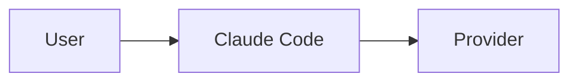

# Love Claude Code Documentation

Welcome to the Love Claude Code documentation! This directory contains comprehensive technical documentation for developers working on or with Love Claude Code.

## 📚 Documentation Structure

### Core Documentation
- [**CLAUDE.md**](../CLAUDE.md) - Main technical documentation and development guidelines
- [**README.md**](../README.md) - Project overview and quick start guide

### Architecture & Design
- [**ARCHITECTURE.md**](./ARCHITECTURE.md) - System architecture and design decisions
- [**PROVIDERS.md**](./PROVIDERS.md) - Multi-provider architecture documentation
- [**SECURITY.md**](./SECURITY.md) - Security considerations and best practices
- [**CONSTRUCT_CATALOG_OVERVIEW.md**](./CONSTRUCT_CATALOG_OVERVIEW.md) - Comprehensive guide to the construct catalog system
- [**CONSTRUCT_ARCHITECTURE_DIAGRAM.md**](./CONSTRUCT_ARCHITECTURE_DIAGRAM.md) - Visual architecture diagrams for the construct system
- [**CONSTRUCT_PRACTICAL_GUIDE.md**](./CONSTRUCT_PRACTICAL_GUIDE.md) - Hands-on examples and best practices

### MCP (Model Context Protocol) Documentation
- [**MCP_PROVIDER_SYSTEM.md**](./MCP_PROVIDER_SYSTEM.md) - Comprehensive MCP system documentation
- [**MCP_API.md**](./MCP_API.md) - REST API reference for MCP endpoints
- [**MCP_QUICK_REFERENCE.md**](./MCP_QUICK_REFERENCE.md) - Quick guide for using MCP features
- [**FRONTEND_MCP.md**](./FRONTEND_MCP.md) - Frontend integration guide for MCP

### Development Guides
- [**DEVELOPMENT.md**](./DEVELOPMENT.md) - Development environment setup
- [**TESTING.md**](./TESTING.md) - Testing strategies and guidelines
- [**DEPLOYMENT.md**](./DEPLOYMENT.md) - Deployment procedures and configurations
- [**CONTRIBUTING.md**](./CONTRIBUTING.md) - Contribution guidelines

### API Documentation
- [**API.md**](./API.md) - REST API documentation
- [**WEBSOCKET.md**](./WEBSOCKET.md) - WebSocket protocol documentation
- [**CLAUDE_API.md**](./CLAUDE_API.md) - Claude integration documentation

### Provider-Specific Guides
- [**LOCAL_PROVIDER.md**](./LOCAL_PROVIDER.md) - Local provider implementation
- [**FIREBASE_PROVIDER.md**](./FIREBASE_PROVIDER.md) - Firebase provider guide
- [**AWS_PROVIDER.md**](./AWS_PROVIDER.md) - AWS provider documentation

## 🚀 Quick Links

### For Developers
1. Start with [DEVELOPMENT.md](./DEVELOPMENT.md) to set up your environment
2. Read [ARCHITECTURE.md](./ARCHITECTURE.md) to understand the system
3. Check [PROVIDERS.md](./PROVIDERS.md) for multi-provider patterns
4. Review [MCP_PROVIDER_SYSTEM.md](./MCP_PROVIDER_SYSTEM.md) for AI-assisted provider management
5. Explore [CONSTRUCT_CATALOG_OVERVIEW.md](./CONSTRUCT_CATALOG_OVERVIEW.md) for infrastructure as code patterns
6. Follow [CONSTRUCT_PRACTICAL_GUIDE.md](./CONSTRUCT_PRACTICAL_GUIDE.md) for hands-on examples

### For Contributors
1. Read [CONTRIBUTING.md](./CONTRIBUTING.md) for guidelines
2. Check [TESTING.md](./TESTING.md) for test requirements
3. Follow patterns in [CLAUDE.md](../CLAUDE.md)

### For Operations
1. See [DEPLOYMENT.md](./DEPLOYMENT.md) for deployment procedures
2. Review [SECURITY.md](./SECURITY.md) for security considerations
3. Check [MONITORING.md](./MONITORING.md) for observability

## 📖 Documentation Standards

### File Naming
- Use UPPERCASE for primary docs (e.g., `README.md`, `ARCHITECTURE.md`)
- Use lowercase with underscores for specific topics (e.g., `mcp_provider_system.md`)
- Keep names descriptive but concise

### Content Structure
1. **Title** - Clear, descriptive title
2. **Overview** - Brief introduction to the topic
3. **Table of Contents** - For longer documents
4. **Main Content** - Organized with clear headings
5. **Examples** - Code examples and use cases
6. **References** - Links to related documentation

### Code Examples
```typescript
// Always include language identifier
// Provide context with comments
// Keep examples practical and runnable
```

### Diagrams
Use Mermaid for diagrams when possible:


## 🔄 Keeping Documentation Updated

1. **Update docs with code changes** - Documentation is part of the PR
2. **Version important changes** - Note breaking changes clearly
3. **Test code examples** - Ensure examples actually work
4. **Review regularly** - Quarterly documentation reviews

## 📝 Documentation TODO

- [x] Add construct catalog documentation
- [x] Create architecture diagrams for construct system
- [x] Add practical guide with examples
- [ ] Add video tutorials and GIFs
- [ ] Create interactive API playground
- [ ] Expand troubleshooting guides
- [ ] Add performance tuning guide

## 🤝 Contributing to Docs

See [CONTRIBUTING.md](./CONTRIBUTING.md#documentation) for guidelines on contributing to documentation.

## 📞 Getting Help

- **GitHub Issues**: For documentation bugs or improvements
- **Discord**: For questions and discussions
- **Claude**: Ask Claude Code itself for help with the codebase!

---

*Last updated: January 2025*