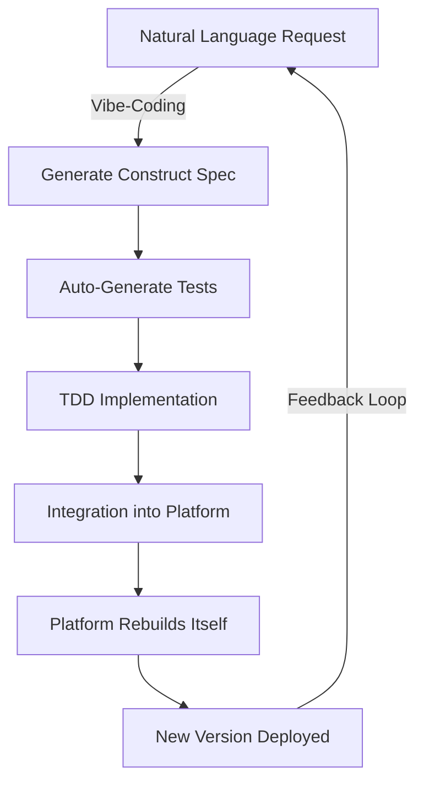
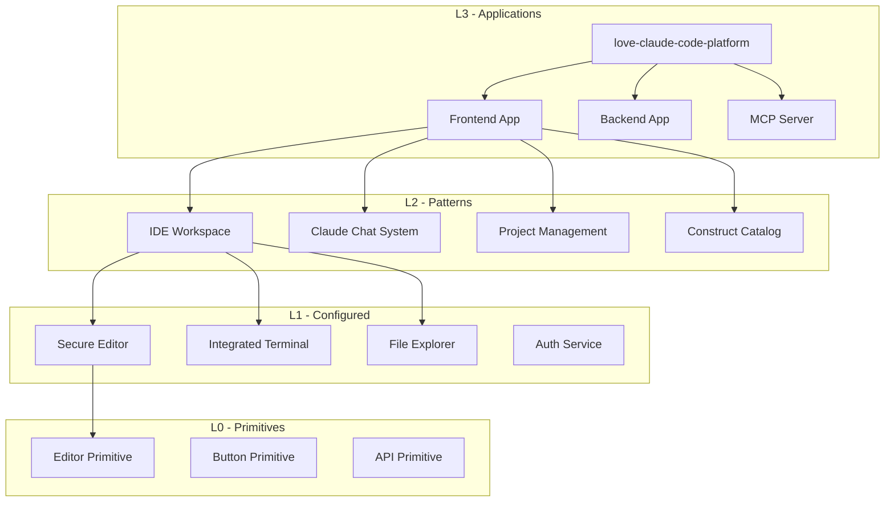

# Self-Referential Architecture & Meta-Development Principles

## Overview

Love Claude Code employs a self-referential architecture where the platform is built using its own tools. This document outlines the technical architecture, meta-development principles, and implementation details that enable the platform to build itself.

## Core Architecture Principles

### 1. Everything is a Construct
Every component of Love Claude Code is represented as a construct in our four-level hierarchy:
- **L0**: Atomic primitives (buttons, containers, APIs)
- **L1**: Configured components with best practices
- **L2**: Architectural patterns
- **L3**: Complete applications (including the platform itself)

### 2. Recursive Self-Building
The platform uses its own vibe-coding capabilities to develop new features:
```
Platform v1 → Creates Constructs → Builds Platform v2 → Creates Better Constructs → Builds Platform v3 → ∞
```

### 3. Test-Driven Meta-Development
Every construct, including those that build the platform, follows TDD:
- Specifications generate tests
- Tests drive implementation
- Platform tests itself continuously

## Technical Architecture

### Platform as Constructs

```yaml
# The entire platform is an L3 construct
love-claude-code-platform:
  id: platform-l3-love-claude-code
  type: L3
  version: 2.0.0
  uses:
    - love-claude-code-frontend
    - love-claude-code-backend  
    - love-claude-code-mcp-server
  
  # Self-referential metadata
  metadata:
    builtWith: love-claude-code
    vibeCodingPercentage: 87
    constructReusePercentage: 94
```

### Component Hierarchy

#### Frontend Application (L3)
```yaml
love-claude-code-frontend:
  type: L3
  uses:
    # L2 Patterns
    - ide-workspace
    - claude-conversation-system
    - project-management-system
    - construct-catalog-system
```

#### IDE Workspace (L2)
```yaml
ide-workspace:
  type: L2
  uses:
    # L1 Components
    - secure-code-editor
    - integrated-terminal
    - project-file-explorer
    - responsive-layout
```

#### Secure Code Editor (L1)
```yaml
secure-code-editor:
  type: L1
  uses:
    # L0 Primitives
    - code-editor-primitive
    - syntax-highlighter-primitive
    - autocomplete-primitive
  features:
    - xss-protection
    - input-validation
    - theme-support
```

#### Code Editor Primitive (L0)
```yaml
code-editor-primitive:
  type: L0
  technology: CodeMirror 6
  description: Raw editor with no opinions
```

## Self-Hosting Implementation

### Deployment Architecture

```typescript
class PlatformSelfDeployment {
  async deployPlatform(config: PlatformConfig) {
    // 1. Build platform constructs
    const frontend = await this.buildConstruct('love-claude-code-frontend')
    const backend = await this.buildConstruct('love-claude-code-backend')
    const mcp = await this.buildConstruct('love-claude-code-mcp-server')
    
    // 2. Compose into platform
    const platform = new L3Construct('love-claude-code-platform', {
      components: { frontend, backend, mcp },
      version: config.version
    })
    
    // 3. Deploy using local provider
    const deployment = await this.deploymentProvider.deployPlatform({
      construct: platform,
      environment: config.environment,
      enableHotReload: true
    })
    
    return deployment
  }
}
```

### Version Management

```typescript
interface PlatformVersion {
  version: string // semver
  constructs: Map<string, string> // construct -> version
  features: string[]
  vibeCodingStats: {
    totalLines: number
    vibeCodedLines: number
    percentage: number
  }
  selfBuildingScore: number // 0-100
}

class PlatformVersionManager {
  async getCurrentVersion(): Promise<PlatformVersion> {
    return {
      version: '2.0.0',
      constructs: new Map([
        ['love-claude-code-frontend', '2.0.0'],
        ['love-claude-code-backend', '2.0.0'],
        ['secure-code-editor', '1.5.0'],
        // ... all constructs
      ]),
      features: [
        'vibe-coding',
        'construct-marketplace',
        'self-deployment'
      ],
      vibeCodingStats: {
        totalLines: 50000,
        vibeCodedLines: 43500,
        percentage: 87
      },
      selfBuildingScore: 94
    }
  }
}
```

## Meta-Development Workflow

### 1. Feature Development Cycle



### 2. Construct Development Process

#### Step 1: Natural Language Specification
```markdown
User: "Add real-time collaboration to the editor"
```

#### Step 2: Construct Generation
```typescript
// Generated L2 construct
export class RealTimeCollaboration extends L2Construct {
  constructor(name: string, args: CollaborationArgs) {
    super('platform-l2-realtime-collaboration', name, {}, opts)
    
    // Compose from L1 constructs
    this.websocket = new AuthenticatedWebSocket(`${name}-ws`, {
      authentication: 'jwt',
      reconnection: true
    })
    
    this.conflictResolver = new ConflictResolver(`${name}-resolver`, {
      algorithm: 'operational-transform'
    })
    
    this.presenceTracker = new PresenceTracker(`${name}-presence`, {
      timeout: 30000
    })
  }
}
```

#### Step 3: Platform Integration
```typescript
// Platform automatically integrates new construct
class PlatformConstructIntegrator {
  async integrateConstruct(construct: Construct) {
    // 1. Add to construct catalog
    await this.catalog.register(construct)
    
    // 2. Update platform dependencies
    await this.updatePlatformDependencies(construct)
    
    // 3. Rebuild affected components
    await this.rebuildComponents(construct.affects)
    
    // 4. Hot reload if in development
    if (this.isDevelopment) {
      await this.hotReload(construct)
    }
  }
}
```

### 3. Self-Testing Architecture

```typescript
class PlatformSelfTest {
  async runSelfTests() {
    const results = {
      l0Tests: await this.testL0Constructs(),
      l1Tests: await this.testL1Constructs(),
      l2Tests: await this.testL2Constructs(),
      l3Tests: await this.testL3Constructs(),
      integrationTests: await this.testPlatformIntegration(),
      selfDeploymentTest: await this.testSelfDeployment()
    }
    
    return {
      passed: Object.values(results).every(r => r.passed),
      coverage: this.calculateCoverage(results),
      canSelfBuild: results.selfDeploymentTest.passed
    }
  }
  
  async testSelfDeployment() {
    // Platform deploys a copy of itself
    const deployment = await this.platform.deployPlatform({
      version: 'test',
      environment: 'test'
    })
    
    // Verify the copy works
    const healthCheck = await deployment.checkHealth()
    
    // Verify it can build constructs
    const testConstruct = await deployment.buildConstruct('test-construct')
    
    return {
      passed: healthCheck.healthy && testConstruct.success,
      deployment
    }
  }
}
```

## Vibe-Coding Integration

### Natural Language to Platform Features

```typescript
class VibeCodingPlatformDevelopment {
  async processNaturalLanguageRequest(request: string) {
    // 1. Understand intent
    const intent = await this.claude.analyzeIntent(request)
    
    // 2. Generate construct specification
    const spec = await this.generateConstructSpec(intent)
    
    // 3. Create tests from spec
    const tests = await this.testGenerator.fromSpec(spec)
    
    // 4. Generate implementation
    const implementation = await this.claude.generateCode({
      spec,
      tests,
      existingConstructs: this.catalog.list()
    })
    
    // 5. Integrate into platform
    const construct = await this.createConstruct(implementation)
    await this.platform.integrate(construct)
    
    // 6. Track vibe-coding metrics
    await this.metrics.track({
      type: 'vibe-coded',
      construct: construct.id,
      conversation: request
    })
  }
}
```

### Conversation Tracking

```typescript
interface VibeCodingSession {
  id: string
  timestamp: Date
  conversation: Message[]
  generatedConstructs: Construct[]
  tests: TestResult[]
  integration: IntegrationResult
  platformVersion: {
    before: string
    after: string
  }
}

class VibeCodingHistory {
  async recordSession(session: VibeCodingSession) {
    // Store for platform evolution tracking
    await this.store.save(session)
    
    // Update platform metadata
    await this.platform.updateMetadata({
      lastVibeCodedFeature: session.generatedConstructs[0].name,
      vibeCodingPercentage: await this.calculateVibeCodingPercentage()
    })
  }
}
```

## Platform Evolution Tracking

### Metrics Collection

```typescript
class PlatformEvolutionTracker {
  async collectMetrics(): Promise<PlatformMetrics> {
    return {
      constructs: {
        total: await this.countTotalConstructs(),
        vibeCodedl: await this.countVibeCodedConstructs(),
        manuallyCodedl: await this.countManualConstructs()
      },
      codebase: {
        totalLines: await this.countTotalLines(),
        vibeCodedLines: await this.countVibeCodedLines(),
        constructReusedLines: await this.countReusedLines()
      },
      selfBuilding: {
        canDeployItself: await this.verifySelfDeployment(),
        selfBuildingScore: await this.calculateSelfBuildingScore(),
        featuresBuiltWithItself: await this.listSelfBuiltFeatures()
      },
      development: {
        averageFeatureTime: await this.calculateAverageFeatureTime(),
        vibeCodingVelocity: await this.calculateVibeCodingVelocity(),
        constructReuseRate: await this.calculateReuseRate()
      }
    }
  }
}
```

### Evolution Timeline

```typescript
interface PlatformEvolution {
  version: string
  date: Date
  features: string[]
  constructs: number
  vibeCodingPercentage: number
  milestone: string
}

const evolutionTimeline: PlatformEvolution[] = [
  {
    version: '1.0.0',
    date: new Date('2024-01-01'),
    features: ['basic-editor', 'claude-chat'],
    constructs: 0,
    vibeCodingPercentage: 0,
    milestone: 'Initial platform - traditionally coded'
  },
  {
    version: '2.0.0',
    date: new Date('2024-06-01'),
    features: ['construct-system', 'vibe-coding'],
    constructs: 120,
    vibeCodingPercentage: 87,
    milestone: 'Platform rebuilt using constructs'
  },
  {
    version: '3.0.0',
    date: new Date('2024-12-01'),
    features: ['self-deployment', 'construct-marketplace'],
    constructs: 250,
    vibeCodingPercentage: 94,
    milestone: 'Fully self-referential platform'
  }
]
```

## Construct Dependency Graph



## Benefits of Self-Referential Architecture

### 1. Ultimate Dogfooding
- Every feature we provide is tested by using it ourselves
- Immediate feedback on usability and performance
- Continuous improvement through real usage

### 2. Rapid Evolution
- New features can be vibe-coded using existing platform
- Constructs enable rapid composition of new capabilities
- Platform improves exponentially

### 3. Quality Assurance
- If the platform can build itself, it's production-ready
- Self-testing ensures reliability
- Every construct is battle-tested

### 4. Educational Value
- Platform source code serves as best practices example
- Users can learn by examining how platform is built
- Clear progression from L0 to L3 constructs

## Implementation Challenges & Solutions

### Challenge 1: Bootstrap Problem
**Problem**: How to build initial version without constructs?
**Solution**: Version 1.0 traditionally coded, then rebuilt as constructs

### Challenge 2: Circular Dependencies
**Problem**: Platform depends on constructs which depend on platform
**Solution**: Layered architecture with clear boundaries

### Challenge 3: Version Management
**Problem**: Platform evolving while building itself
**Solution**: Immutable construct versions, hot-reloading in development

### Challenge 4: Testing Recursion
**Problem**: Testing framework testing itself
**Solution**: Bootstrap tests, then self-testing infrastructure

## Future Enhancements

### 1. AI-Driven Evolution
- Claude suggests platform improvements
- Automatic feature generation based on usage patterns
- Self-optimizing architecture

### 2. Community Constructs
- Users contribute constructs that enhance platform
- Democratic feature voting
- Automatic integration of popular constructs

### 3. Multi-Platform Variants
- Platform generates specialized versions of itself
- Domain-specific platforms (e.g., Love Claude Code for Games)
- Automatic platform optimization

## Conclusion

The self-referential architecture of Love Claude Code represents a new paradigm in platform development. By using its own tools to build itself, the platform demonstrates the ultimate confidence in its capabilities while pioneering a sustainable, rapidly-evolving development model.

---

*"A platform that cannot build itself is incomplete. Love Claude Code completes the circle."*