business_plan.md 
# Love Claude Code 💜

<div align="center">
  <h3>The AI-first development platform that transforms conversations into code</h3>
  
  [](https://opensource.org/licenses/MIT)
  [](https://nodejs.org)
  [](https://www.typescriptlang.org/)
  [](https://react.dev/)
  [](https://www.anthropic.com/)
  [](https://modelcontextprotocol.io/)
  
  [**🚀 Get Started**](#-quick-start) • [**📖 Documentation**](/docs) • [**🎯 Features**](#-features-that-developers-love) • [**🌐 Providers**](#-multi-cloud-architecture)

</div>

---

## 🆕 Recent Updates (January 2025)

### 🖥️ Electron Desktop App
- **Desktop Application**: Full offline development with Electron desktop app
- **Claude Max Integration**: Native OAuth authentication for Claude Max subscribers
- **Claude CLI Integration**: Use Claude Code CLI for terminal-based AI assistance
- **Local Development**: Complete offline mode with local file storage
- **OS Integration**: Native menus, keyboard shortcuts, and OS keychain for credentials
- **Git Integration**: Built-in Git support with visual status and commit interface
- **Project Import/Export**: Export projects as .lcc archives for sharing and backup
- **File Watching**: Real-time file change detection and sync
- **Advanced Search**: Find files by name, content, or modification time
- **Offline Indicators**: Visual feedback for offline/local mode status
- **Onboarding Flow**: Step-by-step setup wizard for new users

### 🎨 Complete Website Overhaul
- **Beautiful Landing Page**: New landing page with hero section, feature showcase, and provider comparison
- **Documentation Center**: Full documentation website with sidebar navigation, search, and interactive examples
- **Interactive Visualizations**: Architecture diagrams (ReactFlow) and provider comparison charts (Recharts)
- **Navigation System**: New navigation bar with Home, Projects, Documentation, and Features sections

### 🎯 Navigation & Project Management
- **Project Dashboard**: New project management interface with create, open, and delete functionality
- **Breadcrumb Navigation**: Clear project context in header with multiple navigation options
- **Quick Access**: Back button, project name click, and File menu navigation

### 💬 Enhanced Chat Experience
- **Responsive Design**: Automatic layout adjustment for narrow panels
- **Smart Text Scaling**: Font sizes adapt to panel width for better readability
- **Improved Input**: Dynamic placeholders and always-visible microphone button

### 🛠️ Developer Experience
- **Fixed Editor Visibility**: Resolved panel sizing issues for proper editor display
- **Better Terminal Layout**: Improved space distribution between editor and terminal
- **In-App Documentation**: Comprehensive help system with F1 keyboard shortcut

### 🤖 Model Context Protocol (MCP)
- **Dual MCP Integration**: Main app servers for UI testing and provider management
- **User App MCP**: Enable Claude interactions in your own projects
- **Visual Tool Management**: Configure MCP tools through project settings
- **Auto-Start with Dev**: MCP servers start automatically with `make dev`
- **Fixed Provider Server**: Resolved dependencies and TypeScript issues for reliable MCP operation

### 🏗️ Construct System Revolution
- **78 Production-Ready Constructs**: Complete implementation across all levels (25 L0, 27 L1, 21 L2, 5 L3)
- **Self-Referential Platform**: Platform built with its own constructs (82% vibe-coded)
- **Visual Development Tools**: 
  - ConstructBuilder IDE with live preview
  - Visual Composer drag-and-drop UI builder
  - Interactive architecture diagrams
- **External Integrations**: 
  - NPM package wrapper
  - Docker service integration
  - MCP server creation
  - Featured: Playwright, Airflow, Superset, Grafana
- **Construct Marketplace**: Browse, install, and share community constructs
- **TDD/SDD Infrastructure**: Test-Driven and Specification-Driven Development tools
- **"Built with Itself" Showcase**: See which constructs power each platform feature

### 🏢 Enterprise Features Now Available
- **SSO Integration**: SAML 2.0 and OAuth support for enterprise authentication
- **Role-Based Access Control**: Fine-grained permissions and team management
- **Performance Monitoring**: Real-time dashboards with metrics and analytics
- **Audit Logging**: Complete activity tracking for compliance
- **Self-Hosting Options**: Deploy on your own infrastructure
- **Advanced Analytics**: Usage metrics, cost tracking, and team insights
- **Enterprise Admin Panel**: Comprehensive L3 construct for administration

---

## ✨ What is Love Claude Code?

Love Claude Code is a revolutionary web-based IDE that seamlessly integrates **Claude's conversational AI** with a complete development environment. Instead of writing code line by line, developers describe what they want to build in natural language, and Claude generates, refines, and deploys production-ready applications in real-time.

### 🎉 100% Platform Completion Achieved!
We're thrilled to announce that Love Claude Code has reached **100% completion** with all 239 tracked tasks finished through innovative agent parallelization. The platform now features 78 production-ready constructs and is ready for production use!

### 🎯 Core Philosophy
> **"From Conversation to Code to Deployment in Minutes, Not Hours"**

We believe the future of software development is conversational. Why struggle with syntax when you can simply describe your vision and watch it come to life?

---

## 🚀 Features That Developers Love

### 🤖 **AI-First Development**
- **Conversational Coding**: Describe features in plain English, get production code
- **Dual Authentication**: Use Claude with API keys or Claude Max subscription
- **Model Context Protocol (MCP)**: Enable Claude to interact with your apps through custom tools
- **Intelligent Context**: Claude understands your entire codebase and project history
- **Real-time Streaming**: Watch your code generate live as you type
- **Smart Suggestions**: Proactive architecture and optimization recommendations

### 🎨 **Modern Development Experience**
- **Dual-Pane Interface**: Code editor alongside AI chat for seamless workflow
- **Live Preview**: See your changes instantly with hot reload
- **Multi-Language Support**: React, Vue, Node.js, Python, and more
- **Git Integration**: Full version control with automated commit messages

### 🏗️ **Self-Referential Construct System**
- **4-Level Architecture**: From L0 primitives to L3 complete applications
- **78 Production-Ready Constructs**: 
  - L0: 25 primitives (UI, Infrastructure, MCP, External Integration)
  - L1: 27 components (Enhanced UI, Secure Infrastructure, Dev Tools)
  - L2: 21 patterns (Complete features, MCP, visualization, integrations)
  - L3: 5 applications (Full platform implementations)
- **Visual Construct Development**: ConstructBuilder IDE with live preview
- **Construct Marketplace**: Browse, install, and share community constructs
- **Interactive Architecture Diagrams**: Visualize dependencies and relationships
- **"Built with Itself" Showcase**: Platform uses its own constructs (82% vibe-coded)

### 👥 **Built for Teams**
- **Real-time Collaboration**: Google Docs-style editing with your team
- **Smart Conflict Resolution**: AI-powered merge conflict resolution
- **Shared Context**: Team knowledge base that Claude learns from
- **Role-based Access**: Granular permissions and workspace management

### 🛡️ **Enterprise Ready**
- **Secure Code Execution**: Sandboxed containers with resource limits
- **SOC2 Compliance**: Enterprise-grade security from day one
- **Private Claude Instances**: Dedicated AI for your organization
- **Audit Logging**: Complete activity tracking and compliance reporting
- **SSO & RBAC**: Single Sign-On with role-based access control
- **Performance Monitoring**: Real-time dashboards and analytics
- **Self-Hosting**: Deploy on your own infrastructure
- **Advanced Analytics**: Usage metrics and team insights

### 🖥️ **Desktop App Features**
- **Claude Max OAuth**: Native authentication for Claude Max subscribers
- **Offline Development**: Full functionality without internet connection
- **Git Integration**: Visual Git status, commit, branch, and merge operations
- **Project Export/Import**: Share projects as .lcc archives
- **File Watching**: Real-time sync with external editor changes
- **Advanced Search**: Find files by name, content, or modification time
- **Native Menus**: OS-integrated menus and keyboard shortcuts
- **Auto Updates**: Automatic update checking with visual progress
- **System Tray**: Minimize to tray with quick project access
- **Native Notifications**: System notifications for important events
- **Multiple Windows**: Open multiple projects simultaneously
- **Badge Counter**: Unread notification count (macOS)

---

## 🎥 See It In Action

### 🌟 Beautiful Landing Page
Experience our new landing page with smooth animations, feature showcases, and provider comparisons.

### 📚 Comprehensive Documentation Center
<div align="center">
  <table>
    <tr>
      <td align="center">
        <strong>Interactive Architecture Diagram</strong><br>
        <em>Visualize system components with ReactFlow</em>
      </td>
      <td align="center">
        <strong>Provider Comparison Charts</strong><br>
        <em>Compare costs and features with Recharts</em>
      </td>
    </tr>
    <tr>
      <td align="center">
        <strong>API Reference</strong><br>
        <em>Complete REST API documentation</em>
      </td>
      <td align="center">
        <strong>Getting Started Guide</strong><br>
        <em>Step-by-step onboarding</em>
      </td>
    </tr>
  </table>
</div>

### 💻 Development Experience
- **AI Chat + Code Editor**: Side-by-side development with Claude
- **Live Preview**: See changes instantly as you code
- **Multi-Provider Support**: Switch between Local, Firebase, and AWS backends

---

## 🖥️ Desktop App (Electron)

Love Claude Code is available as a native desktop application, providing the ultimate development experience for Claude Max subscribers and offline development enthusiasts.

### Desktop App Benefits
- **🔐 Claude Max OAuth**: Seamless authentication with your Claude Max subscription
- **💾 Local Everything**: All data stored locally - no cloud required
- **🚀 Better Performance**: Native app performance without browser overhead
- **🔌 Offline Mode**: Full functionality without internet connection
- **🖼️ Multiple Windows**: Work on multiple projects simultaneously
- **⌨️ Native Shortcuts**: OS-integrated keyboard shortcuts and menus

### Claude CLI Integration
The desktop app integrates directly with Claude CLI, allowing you to:
```bash
# Use Claude in your terminal
claude "create a React component for user authentication"

# The desktop app automatically detects and uses your Claude CLI OAuth token
# No separate API key configuration needed!
```

### Project Import/Export
Share your projects easily with the new import/export feature:
- Export projects as `.lcc` archives
- Include/exclude node_modules, Git history, and hidden files
- Create project templates for reuse
- Import projects from colleagues or the community

### Git Integration
Full Git support built into the desktop app:
- Visual Git status in the header
- One-click commit with file selection
- Branch management and switching
- Diff viewer for changes
- Automated commit messages by Claude

---

## 🏃‍♂️ Quick Start

### Prerequisites
- Node.js 20+ 
- npm or yarn
- Docker (optional, for containerized development)
- Make (optional, for simplified commands)

### 🔒 Security First
Before getting started, please review our [Security Policy](./SECURITY.md) for best practices on handling credentials and secrets. Never commit API keys or passwords!

### 1. Clone and Install

#### Option A: Desktop App (Recommended for Claude Max users)
```bash
# Download the desktop app from releases
# https://github.com/love-claude-code/love-claude-code/releases

# Or build from source:
git clone https://github.com/love-claude-code/love-claude-code.git
cd love-claude-code
npm install
make electron-build  # or npm run electron:build

# Run the desktop app in development:
make electron-dev  # or npm run electron:dev

# Build for distribution:
make electron-dist  # Creates installers for all platforms

# Platform-specific builds:
make electron-pack-mac    # macOS only
make electron-pack-win    # Windows only  
make electron-pack-linux  # Linux only

# The desktop app includes:
# - Full offline development
# - Claude Max OAuth integration
# - Claude CLI integration  
# - Built-in Git support
# - Project import/export
# - OS-native features
# - No server required
```

#### Option B: Web Development
```bash
git clone https://github.com/love-claude-code/love-claude-code.git
cd love-claude-code

# Copy environment template
cp .env.example .env.local
cp .env.docker.example .env  # For Docker users

make install  # or npm install
```

### 2. Quick Start (Zero Configuration!)

```bash
# Start with local provider - no external services needed!
make dev  # or npm run dev

# Open http://localhost:3000
# All credentials can be configured in the app settings
```

### 🐳 Full Stack Development (All Providers)

```bash
# Start complete development environment with all providers
docker-compose -f docker-compose.providers.yml up

# This includes:
# - Frontend (port 3000)
# - Backend with all providers (port 8080)
# - PostgreSQL for local provider
# - LocalStack for AWS emulation
# - Firebase emulator suite
# - Redis for caching
# - Monitoring (Prometheus + Grafana)
# - Email testing (Mailhog)
```

### 3. Configure In-App Settings

1. Open [http://localhost:3000](http://localhost:3000)
2. Sign up with your email (stored locally)
3. Go to Settings → AI Settings
4. Choose your authentication method:
   - **API Key**: Add your Anthropic API key (pay-per-use)
   - **Claude Max**: Sign in with your Claude.ai account ($200/month subscription)
5. Select your preferred backend provider

### 4. Create Your First Project

1. Click "New Project" 
2. Choose your project type:
   - **Full Stack Application** - Traditional web app development
   - **Construct Development** - Build reusable constructs
   - **MCP Server** - Create Model Context Protocol servers
   - **External Integration** - Integrate with Docker, NPM, or APIs
3. Select your backend provider (Local, Firebase, or AWS)
4. Describe what you want to build
5. Watch Claude generate your application!

### 🎨 Visual Development Tools

**Visual Composer** - Drag-and-drop UI builder:
- Create UIs without writing code
- Real-time preview as you build
- Export to React components
- Integrated with construct system

**ConstructBuilder IDE** - Visual construct development:
- Live preview of your constructs
- Auto-generated TypeScript code
- Built-in testing and validation
- Direct publishing to marketplace

### 🎯 Provider Quick Start

#### Local Development (Default)
```bash
# No configuration needed!
make dev-local  # Everything runs locally
```

#### Firebase Development
```bash
# Start Firebase emulator
make firebase-emulator

# Configure Firebase project in app settings
make dev-firebase
```

#### AWS Development
```bash
# Start LocalStack
make localstack

# Configure AWS credentials in app settings
make dev-aws
```

---

## 🏗️ Self-Referential Construct System

Love Claude Code is built using its own construct system - a hierarchical architecture of reusable components that enables the platform to build itself. Navigate to the **Constructs** tab in the app to explore the complete catalog.

### 🎨 The Platform That Builds Itself
- **82% Vibe-Coded**: The platform is built using its own constructs and Claude
- **Interactive Architecture**: Real-time dependency graphs and visualizations
- **"Built with Itself" Showcase**: See which constructs power each feature
- **TDD/SDD Infrastructure**: Test-Driven and Specification-Driven Development tools

### Construct Levels

| Level | Description | Examples | Count |
|-------|-------------|----------|-------|
| **L0** | Primitives - Zero-config basic components | CodeEditorPrimitive, ButtonPrimitive | 25 |
| **L1** | Enhanced - Production-ready with security | SecureCodeEditor, IntegratedTerminal | 20 |
| **L2** | Patterns - Common architectural solutions | IDEWorkspace, MCPServerPattern | 12 |
| **L3** | Applications - Complete solutions | LoveClaudeCodePlatform, ConstructBuilder | 4 |

### Featured Constructs

#### 🌟 External Integration Constructs (New!)
**L2 Patterns:**
- `PlaywrightMCPIntegration` - Browser automation with MCP tools
- `AirflowIntegration` - Workflow orchestration and DAG management
- `SupersetIntegration` - Business intelligence and data visualization
- `GrafanaIntegration` - Metrics monitoring and dashboards

#### 🛠️ Development Tools
**L3 Applications:**
- `ConstructBuilder` - Visual IDE for creating constructs
- `VisualComposer` - Drag-and-drop UI builder
- `TestRunner` - TDD infrastructure with live validation
- `SpecificationEditor` - SDD tools for formal specifications

#### 📦 Complete Construct Catalog

**L0 Primitives (25 Total):**
- **UI**: Button, Modal, Panel, Tab, Editor, Chat, FileTree, Terminal, Form, Table, Chart, Graph
- **Infrastructure**: Docker, WebSocket, API, Database, Storage, Auth, Cache, Queue
- **MCP**: Tool, Server, Handler, Schema
- **External**: NPMPackage, DockerService, LayoutEngine

**L1 Enhanced Components (20 Total):**
- **UI**: SecureEditor, AIChat, FileExplorer, IntegratedTerminal, ResponsiveLayout, ThemedComponents, DraggableNodes, ConnectedEdges, ZoomableGraph, DiagramToolbar
- **Infrastructure**: ManagedContainer, AuthenticatedWebSocket, CachedAPI, EncryptedDatabase, CDNStorage, RateLimitedEndpoint, MonitoredService, LoadBalancedServer, AutoScalingGroup, BackupService

**L2 Patterns (12 Total):**
- **Core**: IDEWorkspace, APIPattern, RealtimeCollaboration, TDDPattern
- **Integration**: MCPServerPattern, ToolOrchestrationPattern, PluginSystemPattern
- **External**: PlaywrightMCP, Airflow, Superset, Grafana, NPMIntegration

**L3 Applications (4 Total):**
- `LoveClaudeCodePlatform` - The complete platform itself
- `ConstructBuilder` - Visual construct development environment
- `MCPDevelopmentEnvironment` - Complete MCP server builder
- `EnterpriseAdminPanel` - Full admin dashboard with analytics

### Using Constructs

```typescript
// Import and use constructs in your project
import { SecureCodeEditor } from '@love-claude-code/constructs'

const editor = new SecureCodeEditor()
await editor.initialize({
  theme: 'dark',
  language: 'typescript',
  securityLevel: 'strict'
})
```

Visit the [Construct Catalog Documentation](./docs/CONSTRUCT_CATALOG_OVERVIEW.md) for detailed information.

### 🔨 Getting Started with Construct Development

1. **Choose Your Development Method**:
   - **ConstructBuilder IDE**: Visual development with live preview
   - **Construct Development Project**: Create a new project with type "Construct Development"
   - **Visual Composer**: Drag-and-drop UI builder for rapid prototyping

2. **Explore the Catalog**: Browse 61 production-ready constructs
   - Filter by level (L0-L3) and category
   - View interactive demos and documentation
   - Analyze dependencies with visual graphs
   - Check "Built with Itself" badges

3. **Create Your First Construct**:
   ```typescript
   // Start with an L0 primitive
   export class MyButtonPrimitive extends L0UIConstruct {
     metadata = {
       vibeCodedPercentage: 85,  // How much was built with Claude
       builtWithItself: true,    // Uses platform constructs
       developmentMethod: 'ConstructBuilder'
     }
     
     render() {
       return <button>{this.props.children}</button>
     }
   }
   ```

4. **Integrate External Services**:
   - **NPM Packages**: Import any npm package as a construct
   - **Docker Services**: Wrap Docker containers as constructs
   - **MCP Servers**: Create MCP-enabled constructs
   - **API Integrations**: Build constructs for external APIs

5. **Share with the Community**: 
   - Test with integrated TDD infrastructure
   - Package with metadata and documentation
   - Publish to the construct marketplace
   - Earn recognition for popular constructs

See the [Construct Development Guide](./docs/CONSTRUCT_DEVELOPMENT_GUIDE.md) for comprehensive tutorials.

---

## 🌐 Multi-Cloud Architecture

Love Claude Code's unique provider abstraction allows you to start simple and scale globally:

### 🏠 Local Provider (Zero Config!)
Perfect for learning and prototyping
- ✅ No setup required
- ✅ File-based storage
- ✅ Runs on your machine
- ✅ Zero cloud costs
- 📊 Best for: 1-10 users

### 🔥 Firebase Provider
Rapid deployment with real-time features
- ✅ One-click setup
- ✅ Real-time sync
- ✅ Built-in authentication
- ✅ Global CDN
- 📊 Best for: 10-100K users
- 💰 ~$150/month for 10K users

### ☁️ AWS Provider
Enterprise-scale with complete control
- ✅ Unlimited scalability
- ✅ Fine-grained control
- ✅ Cost optimization
- ✅ Global infrastructure
- 📊 Best for: 100K+ users
- 💰 ~$300/month for 10K users

### 🔄 Switch Anytime
```bash
# Start with Local
make dev

# Ready for users? Switch to Firebase
npm run switch-provider firebase

# Going big? Migrate to AWS
npm run migrate-to aws
```

---

## 🤖 Model Context Protocol (MCP)

Love Claude Code includes comprehensive MCP integration at two levels:

### 1. Main App MCP Servers

**UI Testing Server** - Test and automate the Love Claude Code interface:
- Take screenshots of your development environment
- Inspect DOM elements and styles
- Automate UI interactions
- Validate layouts and responsiveness

**Provider Management Server** - Intelligent backend provider selection:
- Analyze project requirements
- Compare providers (Local, Firebase, AWS)
- Estimate costs based on usage
- Plan and execute migrations

### 2. User App MCP

Enable Claude to interact with YOUR applications:
- ✅ Check "Enable MCP" when creating projects
- 🛠️ Configure tools via Project Settings → MCP tab
- 🎯 Pre-built tools for auth, data, and UI
- ⚡ Create custom tools for your app's needs

### Quick Example

```javascript
// Your app's custom MCP tool
{
  name: 'create_blog_post',
  description: 'Create a new blog post',
  inputSchema: {
    type: 'object',
    properties: {
      title: { type: 'string' },
      content: { type: 'string' },
      tags: { type: 'array' }
    }
  }
}
```

Then in Claude: *"Create a blog post about MCP integration"*

---

## 🔌 External Integrations

Love Claude Code seamlessly integrates with external services through its construct system:

### 📦 NPM Package Integration
Transform any npm package into a reusable construct:
```typescript
// Automatically wrap npm packages
import { createNPMConstruct } from '@love-claude-code/constructs'

const ChartConstruct = await createNPMConstruct({
  package: 'chart.js',
  version: '^4.0.0',
  wrapper: 'react-chartjs-2'
})
```

### 🐳 Docker Service Integration
Run any Docker container as a construct:
```typescript
const PostgresConstruct = new DockerServiceConstruct({
  image: 'postgres:15',
  ports: ['5432:5432'],
  environment: {
    POSTGRES_PASSWORD: 'secure-password'
  },
  healthCheck: {
    test: ['CMD', 'pg_isready'],
    interval: 30,
    retries: 5
  }
})
```

### 🤖 MCP Server Integration
Create MCP-enabled constructs for AI interactions:
```typescript
const BrowserAutomation = new PlaywrightMCPConstruct({
  tools: ['navigate', 'click', 'type', 'screenshot'],
  permissions: ['browser.read', 'browser.write'],
  rateLimits: { requestsPerMinute: 60 }
})
```

### 🌟 Featured Integrations

#### Playwright MCP Integration
- Browser automation with Claude
- Visual testing and screenshots
- E2E test generation
- Web scraping capabilities

#### Apache Airflow Integration
- Workflow orchestration
- DAG visualization
- Task scheduling
- Data pipeline management

#### Apache Superset Integration
- Business intelligence dashboards
- SQL query builder
- Chart creation
- Data exploration

#### Grafana Integration
- Real-time monitoring
- Custom dashboards
- Alert management
- Metrics visualization

---

## 🏗️ Architecture

Love Claude Code now supports **multiple cloud providers** and **local development**, allowing you to choose the best backend for your needs.

```mermaid
graph TB
    subgraph "Frontend"
        UI[React + TypeScript]
        Editor[CodeMirror 6]
        Chat[Claude Chat Interface]
        Preview[Live Preview]
        Settings[In-App Settings]
        ConstructBuilder[Construct Builder]
    end
    
    subgraph "Construct System"
        L0[L0 Primitives]
        L1[L1 Components]
        L2[L2 Patterns]
        L3[L3 Applications]
        Marketplace[Construct Marketplace]
    end
    
    subgraph "Provider Abstraction"
        Factory[Provider Factory]
        Interface[Common Interfaces]
        Shared[Shared Utilities]
    end
    
    subgraph "External Integrations"
        NPM[NPM Packages]
        Docker[Docker Services]
        MCP[MCP Servers]
        APIs[External APIs]
    end
    
    subgraph "Local Provider"
        LocalAuth[JWT Auth]
        LocalDB[PostgreSQL/JSON]
        LocalStorage[File System]
        LocalFunctions[Node.js Functions]
        LocalRealtime[WebSocket Server]
    end
    
    subgraph "Firebase Provider"
        FirebaseAuth[Firebase Auth]
        Firestore[Firestore DB]
        FirebaseStorage[Cloud Storage]
        CloudFunctions[Cloud Functions]
        FirebaseRealtime[Realtime DB]
        FCM[Cloud Messaging]
    end
    
    subgraph "AWS Provider"
        Cognito[AWS Cognito]
        DynamoDB[DynamoDB]
        S3[S3 Storage]
        Lambda[Lambda Functions]
        AppSync[AppSync/WebSocket]
        SES[SES/SNS]
    end
    
    subgraph "Enterprise Features"
        SSO[SSO/SAML]
        RBAC[Role-Based Access]
        Monitoring[Performance Monitoring]
        Analytics[Usage Analytics]
        AuditLog[Audit Logging]
    end
    
    UI --> ConstructBuilder
    ConstructBuilder --> L0
    L0 --> L1
    L1 --> L2
    L2 --> L3
    L3 --> Marketplace
    
    L2 --> NPM
    L2 --> Docker
    L2 --> MCP
    L2 --> APIs
    
    UI --> Factory
    Factory --> Interface
    Interface --> LocalAuth
    Interface --> FirebaseAuth
    Interface --> Cognito
    
    Shared --> SSO
    Shared --> RBAC
    Shared --> Monitoring
    Shared --> Analytics
    Shared --> AuditLog
    
    Settings --> Factory
```

<div align="center">
  


</div>

### 🌐 Multi-Cloud Support

Love Claude Code features a **revolutionary provider abstraction layer** that lets you deploy your applications to any cloud provider or run entirely locally - all from the same codebase!

#### Provider Comparison

| Provider | Best For | Key Features | Infrastructure | Status |
|----------|----------|--------------|----------------|--------|
| **Local** | Development & Testing | • Zero configuration<br>• No external dependencies<br>• File-based storage<br>• Built-in auth | PostgreSQL, File System, Node.js | ✅ Production Ready |
| **Firebase** | Rapid Prototyping | • Real-time sync<br>• Auto-scaling<br>• Google integration<br>• Built-in analytics | Firestore, Cloud Storage, Cloud Functions | ✅ Production Ready |
| **AWS** | Enterprise & Scale | • Fine-grained control<br>• Compliance ready<br>• Global infrastructure<br>• Advanced monitoring | DynamoDB, S3, Lambda, Cognito | ✅ Production Ready |

#### 🔧 Unified Provider Interface

All providers implement the same interfaces, ensuring **write once, deploy anywhere**:

```typescript
interface BackendProvider {
  auth: AuthProvider        // User management, JWT tokens, sessions
  database: DatabaseProvider // Document storage, queries, transactions  
  storage: StorageProvider   // File upload/download, streaming
  realtime: RealtimeProvider // WebSockets, pub/sub, presence
  functions: FunctionProvider // Serverless compute, scheduled jobs
  notifications?: NotificationProvider // Email, SMS, push (optional)
}
```

#### 🚀 Enterprise Features

Every provider includes production-ready features out of the box:

- **🛡️ Resilience**: Circuit breakers, retry logic, bulkheads
- **📊 Monitoring**: Unified metrics, health checks, distributed tracing
- **⚡ Performance**: Multi-layer caching (Redis + LRU), connection pooling
- **🔒 Security**: Encryption at rest, secure credentials, audit logging
- **📈 Scalability**: Auto-scaling, load balancing, rate limiting

### 🧱 Tech Stack

| Layer | Technology | Why We Chose It |
|-------|------------|----------------|
| **Frontend** | React 18 + TypeScript | Type safety, modern hooks, excellent ecosystem |
| **Editor** | CodeMirror 6 | 43% smaller than Monaco, better mobile support |
| **Styling** | Tailwind CSS | Rapid prototyping, consistent design system |
| **State** | Zustand | Lightweight, no boilerplate, TypeScript native |
| **Backend** | Node.js + TypeScript | Shared language, great AWS integration |
| **Infrastructure** | AWS CDK | Infrastructure as code, type-safe cloud resources |
| **Database** | Aurora + DynamoDB | Relational + NoSQL for different access patterns |
| **AI** | Claude + AWS Bedrock | Best reasoning, enterprise deployment options |
| **MCP** | Model Context Protocol | Enables Claude to understand and manage providers |
| **Deployment** | Docker + ECS | Containerized, scalable, cost-effective |

### 🤖 MCP (Model Context Protocol) Integration

Love Claude Code includes a powerful MCP server that enables Claude to understand your infrastructure needs and help you make informed decisions about backend providers.

**What can Claude help with?**
- 🔍 **Analyze Requirements**: Understand your project needs and constraints
- 📊 **Compare Providers**: See detailed comparisons of Local, Firebase, and AWS
- 💰 **Estimate Costs**: Get accurate cost projections based on usage
- 🔄 **Plan Migrations**: Create step-by-step migration plans between providers
- 🏥 **Monitor Health**: Check provider status and performance
- ⚙️ **Manage Config**: Handle provider settings through conversation

**Example Claude Interactions:**
```
You: "I need a backend for my e-commerce app with 100k users"
Claude: *analyzes requirements and recommends Firebase for rapid development*

You: "How much would it cost to run this on AWS vs Firebase?"
Claude: *provides detailed cost breakdown for both providers*

You: "Help me migrate from local development to Firebase"
Claude: *creates migration plan with estimated timeline*
```

---

## 📁 Project Structure

```
love-claude-code/
├── 📂 frontend/                 # React application
│   ├── 📂 src/
│   │   ├── 📂 components/       # UI components
│   │   │   ├── 📂 Editor/       # Code editor components
│   │   │   ├── 📂 Chat/         # Claude chat interface
│   │   │   ├── 📂 Preview/      # Live app preview
│   │   │   └── 📂 Layout/       # App layout & navigation
│   │   ├── 📂 hooks/            # Custom React hooks
│   │   ├── 📂 stores/           # Zustand state stores
│   │   ├── 📂 services/         # API clients
│   │   ├── 📂 utils/            # Helper functions
│   │   └── 📂 types/            # TypeScript definitions
│   └── 📂 tests/                # Frontend tests
├── 📂 backend/                  # Backend services
│   ├── 📂 src/
│   │   ├── 📂 providers/        # Multi-cloud provider implementations
│   │   │   ├── 📂 local/        # Local development provider
│   │   │   ├── 📂 firebase/     # Firebase provider
│   │   │   ├── 📂 aws/          # AWS provider
│   │   │   └── 📂 shared/       # Shared utilities (cache, monitoring)
│   │   ├── 📂 api/              # REST API endpoints
│   │   ├── 📂 services/         # Business logic
│   │   └── 📂 utils/            # Helper functions
│   └── 📂 tests/                # Backend tests
├── 📂 infrastructure/           # AWS CDK code
│   ├── 📂 stacks/               # CDK stacks
│   ├── 📂 constructs/           # Reusable constructs
│   └── 📂 config/               # Environment configs
├── 📂 docker/                   # Docker configurations
│   ├── 📂 nginx/                # Nginx configs
│   ├── 📂 prometheus/           # Monitoring configs
│   └── 📂 grafana/              # Dashboard configs
├── 📂 scripts/                  # Build & deployment scripts
│   ├── 📂 localstack/           # AWS local development
│   ├── 📂 postgres/             # Database initialization
│   └── 📂 firebase/             # Firebase setup
└── 📂 docs/                     # Documentation
```

---

## 🛠️ Development

### Available Scripts

```bash
# Development
npm run dev                    # Start all services
npm run dev:frontend          # Frontend only (port 3000)
npm run dev:backend           # Backend only (port 8000)

# Electron Desktop App
npm run electron              # Run desktop app
npm run electron:dev          # Development mode with hot reload
npm run electron:build        # Build desktop app for distribution
npm run electron:dist         # Create installer packages

# Testing
npm run test                  # Run all tests
npm run test:frontend         # Frontend tests only
npm run test:backend          # Backend tests only
npm run test:e2e              # End-to-end tests

# Building
npm run build                 # Build for production
npm run build:frontend        # Build frontend only
npm run build:backend         # Build backend only

# Deployment
npm run deploy:dev            # Deploy to development
npm run deploy:staging        # Deploy to staging
npm run deploy:prod           # Deploy to production

# Utilities
npm run lint                  # Lint all code
npm run type-check            # TypeScript checking
npm run clean                 # Clean build artifacts
```

### Local Development with Docker

```bash
# Start local infrastructure
npm run docker:up

# Build and run everything in containers
npm run docker:build && npm run docker:dev

# View logs
npm run docker:logs

# Clean up
npm run docker:down
```

---

## 🧪 MCP UI Testing Server

Love Claude Code includes an MCP (Model Context Protocol) server for programmatic UI testing and interaction:

### Available Tools
- **inspectElement** - Get detailed element properties, styles, and position
- **getPageScreenshot** - Capture full page or viewport screenshots
- **clickElement** - Programmatically click UI elements
- **typeInElement** - Input text into forms and inputs
- **navigateTo** - Navigate between pages and views
- **checkElementVisible** - Verify element visibility and viewport position
- **getComputedStyles** - Inspect final CSS styles
- **validateLayout** - Detect layout issues, overflows, and overlaps

### Setup
```bash
cd mcp-server
npm install
npm run build
npm run start
```

### Usage
Configure your MCP client to connect to the server. The server will launch a browser instance and connect to your local development server for testing.

---

## 🚀 Deployment

Love Claude Code is designed for seamless deployment to AWS with infrastructure as code.

### One-Click AWS Deployment

```bash
# Configure AWS credentials
aws configure

# Deploy to your AWS account
npm run deploy:prod
```

### Manual Deployment Steps

1. **Infrastructure Setup**
   ```bash
   cd infrastructure
   npm run cdk:bootstrap
   npm run cdk:deploy
   ```

2. **Application Deployment**
   ```bash
   npm run build
   npm run deploy:app
   ```

3. **Environment Configuration**
   ```bash
   npm run config:prod
   ```

### Environment Variables

All sensitive configuration can now be managed through the in-app settings! The following are optional environment variables for advanced configuration:

| Variable | Description | Required | Default |
|----------|-------------|----------|---------|
| `PROVIDER_TYPE` | Default backend provider | ❌ | `local` |
| `JWT_SECRET` | Authentication secret | ❌ | Auto-generated |
| `ALLOWED_ORIGINS` | CORS origins | ❌ | `*` |
| `LOG_LEVEL` | Logging level | ❌ | `info` |
| `API_PORT` | Backend API port | ❌ | `8000` |
| `REALTIME_PORT` | WebSocket server port | ❌ | `8001` |

#### Provider-Specific Variables

**Local Provider** (default, no config needed):
- `LOCAL_DATA_PATH` - Data storage path (default: `./data`)

**Firebase Provider**:
- Configure through in-app settings or:
- `FIREBASE_PROJECT_ID` - Your Firebase project ID
- `FIREBASE_API_KEY` - Firebase web API key

**AWS Provider**:
- Configure through in-app settings or:
- `AWS_REGION` - AWS deployment region
- `AWS_ACCESS_KEY_ID` - AWS access key
- `AWS_SECRET_ACCESS_KEY` - AWS secret key

---

## 🤝 Contributing

We love contributions! Whether you're fixing bugs, adding features, or improving documentation, your help makes Love Claude Code better for everyone.

### 🐛 Found a Bug?

1. Check if it's already reported in [Issues](https://github.com/love-claude-code/love-claude-code/issues)
2. Create a new issue with detailed reproduction steps
3. Include your environment details and error logs

### 💡 Want to Add a Feature?

1. Open a [Discussion](https://github.com/love-claude-code/love-claude-code/discussions) first
2. Get feedback from maintainers and community
3. Fork the repo and create a feature branch
4. Submit a PR with tests and documentation

### 📖 Development Guidelines

```bash
# 1. Fork and clone the repo
git clone https://github.com/yourusername/love-claude-code.git

# 2. Create a feature branch
git checkout -b feature/amazing-new-feature

# 3. Make your changes and test
npm run test
npm run lint

# 4. Commit with conventional format
git commit -m "feat(editor): add syntax highlighting for Python"

# 5. Push and create PR
git push origin feature/amazing-new-feature
```

### Code Style

- **TypeScript**: Strict mode enabled, no `any` types
- **Prettier**: Automated code formatting
- **ESLint**: Enforced code quality rules
- **Tests**: Required for all new features
- **Documentation**: Update relevant docs with changes

---

## 📈 Roadmap

### ✅ Completed (2024-2025) - 100% Platform Completion! 🎉
- [x] Core IDE with Claude integration
- [x] Real-time code execution and preview
- [x] Project management system
- [x] User authentication and workspaces
- [x] Multi-provider architecture (Local, Firebase, AWS)
- [x] MCP (Model Context Protocol) integration
- [x] In-app documentation system
- [x] Responsive UI improvements
- [x] 78 Production-ready constructs (L0-L3)
- [x] Self-referential architecture (82% vibe-coded)
- [x] Complete documentation overhaul
- [x] Landing page and marketing site
- [x] Interactive visualizations
- [x] External integrations (8+ tools)
- [x] Enterprise features (SSO, RBAC, monitoring)
- [x] Development tools (Prometheus, ESLint, Jest)
- [x] Security enhancements (sandbox, firewall, vault)
- [x] 5 MCP tools for deployment and debugging
- [x] Educational content and tutorials
- [x] Community contribution system
- [x] **All 239 tracked tasks completed!**

### 🚀 Next Up (Q2 2025)
- [ ] Real-time collaboration and multiplayer editing
- [ ] Advanced Git integration with branch management
- [ ] Custom Claude prompts and personas
- [ ] Mobile app (React Native)
- [ ] API for third-party integrations
- [ ] Plugin system architecture

### 🌟 Future Vision (Q3-Q4 2025)
- [ ] Enterprise SSO and RBAC
- [ ] Private Claude instances for teams
- [ ] Advanced analytics and insights
- [ ] Plugin marketplace
- [ ] Self-hosted enterprise edition
- [ ] Multi-cloud support (Azure, GCP)
- [ ] AI agent marketplace

### 💭 Community Ideas
- [ ] AI-powered code reviews
- [ ] Automated testing generation
- [ ] Performance monitoring integration
- [ ] Database schema designer
- [ ] API documentation generator
- [ ] Code migration tools
- [ ] Voice coding support
- [ ] AR/VR code visualization

---

## 🌟 Community

Join our growing community of developers who are shaping the future of AI-assisted development!

### 💬 Get Help & Share Ideas

- **[Discord](https://discord.gg/love-claude-code)** - Real-time chat with the community
- **[GitHub Discussions](https://github.com/love-claude-code/love-claude-code/discussions)** - Feature requests and Q&A
- **[Twitter](https://twitter.com/loveclaudecode)** - Updates and announcements
- **[YouTube](https://youtube.com/@loveclaudecode)** - Tutorials and demos

### 🏆 Contributors

<div align="center">
  
  [](https://github.com/love-claude-code/love-claude-code/graphs/contributors)
  
  *Thank you to all our amazing contributors!*
  
</div>

### 🌟 Getting Help

Need assistance? We're here to help!

### 📚 Documentation
- **[Complete Documentation](./docs/)** - Start here for comprehensive guides
- **[API Reference](./docs/API.md)** - REST API documentation
- **[Development Guide](./docs/DEVELOPMENT.md)** - Set up your dev environment
- **[Troubleshooting](./CLAUDE.md#troubleshooting-guide)** - Common issues and solutions

### 💬 Community Support
- **[Discord Server](https://discord.gg/love-claude-code)** - Real-time chat with the community
- **[GitHub Discussions](https://github.com/love-claude-code/love-claude-code/discussions)** - Q&A and feature requests
- **[Stack Overflow](https://stackoverflow.com/questions/tagged/love-claude-code)** - Tagged questions

### 🐛 Reporting Issues
- **[Bug Reports](https://github.com/love-claude-code/love-claude-code/issues/new?template=bug_report.md)** - Found a bug?
- **[Feature Requests](https://github.com/love-claude-code/love-claude-code/issues/new?template=feature_request.md)** - Suggest improvements

### 📧 Direct Support
- **Email**: support@love-claude-code.com
- **Enterprise**: enterprise@love-claude-code.com

## 📊 Project Stats

<div align="center">
  
  
  
</div>

---

## 📜 License

Love Claude Code is open source software licensed under the [MIT License](LICENSE).

```
MIT License

Copyright (c) 2025 Love Claude Code

Permission is hereby granted, free of charge, to any person obtaining a copy
of this software and associated documentation files (the "Software"), to deal
in the Software without restriction, including without limitation the rights
to use, copy, modify, merge, publish, distribute, sublicense, and/or sell
copies of the Software, and to permit persons to whom the Software is
furnished to do so, subject to the following conditions:

The above copyright notice and this permission notice shall be included in all
copies or substantial portions of the Software.

THE SOFTWARE IS PROVIDED "AS IS", WITHOUT WARRANTY OF ANY KIND, EXPRESS OR
IMPLIED, INCLUDING BUT NOT LIMITED TO THE WARRANTIES OF MERCHANTABILITY,
FITNESS FOR A PARTICULAR PURPOSE AND NONINFRINGEMENT. IN NO EVENT SHALL THE
AUTHORS OR COPYRIGHT HOLDERS BE LIABLE FOR ANY CLAIM, DAMAGES OR OTHER
LIABILITY, WHETHER IN AN ACTION OF CONTRACT, TORT OR OTHERWISE, ARISING FROM,
OUT OF OR IN CONNECTION WITH THE SOFTWARE OR THE USE OR OTHER DEALINGS IN THE
SOFTWARE.
```

---

## 🙏 Acknowledgments

- **[Anthropic](https://www.anthropic.com/)** for creating Claude, the AI that powers our platform
- **[AWS](https://aws.amazon.com/)** for providing the robust cloud infrastructure
- **[CodeMirror](https://codemirror.net/)** for the excellent code editor foundation
- **[React](https://reactjs.org/)** and the entire open source ecosystem
- **Our Community** for feedback, contributions, and spreading the love

---

<div align="center">
  
  **Made with 💜 by developers, for developers**
  
  [**⭐ Star us on GitHub**](https://github.com/love-claude-code/love-claude-code) • [**🚀 Try Love Claude Code**](https://love-claude-code.dev)
  
  *Building the future of software development, one conversation at a time*
  
</div>