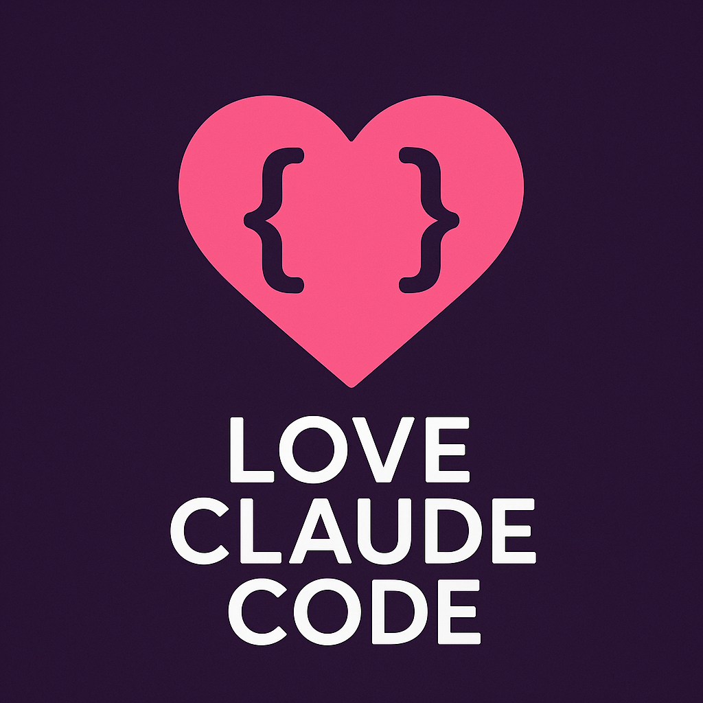
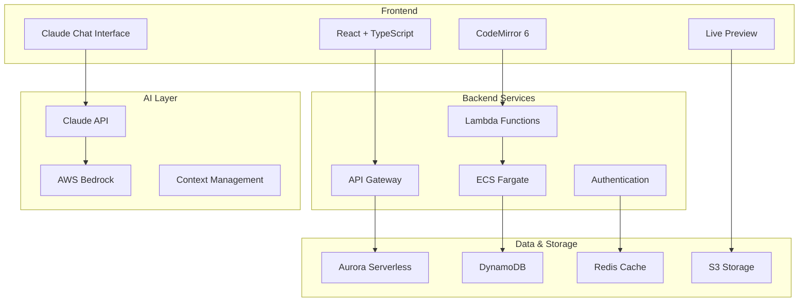

business_plan.md 
# Love Claude Code 💜

<div align="center">
    <a href="https://love-claude-code.dev">
        
    </a>
</div>
  **The AI-first development platform that transforms conversations into code**
  
  [](https://github.com/love-claude-code/love-claude-code)
  [](https://opensource.org/licenses/MIT)
  [](https://www.typescriptlang.org/)
  [](https://www.anthropic.com/)
  [](https://love-claude-code.dev)
  
  [**🚀 Try Live Demo**](https://demo.love-claude-code.dev) • [**📖 Documentation**](https://docs.love-claude-code.dev) • [**💬 Discord**](https://discord.gg/love-claude-code) • [**🐦 Twitter**](https://twitter.com/loveclaudecode)

</div>

---

## ✨ What is Love Claude Code?

Love Claude Code is a revolutionary web-based IDE that seamlessly integrates **Claude's conversational AI** with a complete development environment. Instead of writing code line by line, developers describe what they want to build in natural language, and Claude generates, refines, and deploys production-ready applications in real-time.

### 🎯 Core Philosophy
> **"From Conversation to Code to Deployment in Minutes, Not Hours"**

We believe the future of software development is conversational. Why struggle with syntax when you can simply describe your vision and watch it come to life?

---

## 🚀 Features That Developers Love

### 🤖 **AI-First Development**
- **Conversational Coding**: Describe features in plain English, get production code
- **Intelligent Context**: Claude understands your entire codebase and project history
- **Real-time Streaming**: Watch your code generate live as you type
- **Smart Suggestions**: Proactive architecture and optimization recommendations

### 🎨 **Modern Development Experience**
- **Dual-Pane Interface**: Code editor alongside AI chat for seamless workflow
- **Live Preview**: See your changes instantly with hot reload
- **Multi-Language Support**: React, Vue, Node.js, Python, and more
- **Git Integration**: Full version control with automated commit messages

### 👥 **Built for Teams**
- **Real-time Collaboration**: Google Docs-style editing with your team
- **Smart Conflict Resolution**: AI-powered merge conflict resolution
- **Shared Context**: Team knowledge base that Claude learns from
- **Role-based Access**: Granular permissions and workspace management

### 🛡️ **Enterprise Ready**
- **Secure Code Execution**: Sandboxed containers with resource limits
- **SOC2 Compliance**: Enterprise-grade security from day one
- **Private Claude Instances**: Dedicated AI for your organization
- **Audit Logging**: Complete activity tracking and compliance reporting

---

## 🎥 See It In Action

<div align="center">
  
  https://github.com/user-attachments/assets/demo-video-placeholder
  
  *Building a full-stack React app with authentication in under 5 minutes*
  
</div>

---

## 🏃‍♂️ Quick Start

### Prerequisites
- Node.js 20+ 
- npm or yarn
- AWS CLI (for deployment)
- Anthropic API key

### 1. Clone and Install

```bash
git clone https://github.com/love-claude-code/love-claude-code.git
cd love-claude-code
npm install
```

### 2. Environment Setup

```bash
# Copy environment template
cp .env.example .env.local

# Add your API keys
echo "ANTHROPIC_API_KEY=your_key_here" >> .env.local
echo "AWS_REGION=us-west-2" >> .env.local
```

### 3. Start Development

```bash
# Start all services
npm run dev

# Or start frontend/backend separately
npm run dev:frontend  # http://localhost:3000
npm run dev:backend   # http://localhost:8000
```

### 4. Create Your First Project

1. Open [http://localhost:3000](http://localhost:3000)
2. Sign up with your email
3. Click "New Project" and describe what you want to build
4. Watch Claude generate your application!

---

## 🏗️ Architecture

<div align="center">
  


</div>

### 🧱 Tech Stack

| Layer | Technology | Why We Chose It |
|-------|------------|----------------|
| **Frontend** | React 18 + TypeScript | Type safety, modern hooks, excellent ecosystem |
| **Editor** | CodeMirror 6 | 43% smaller than Monaco, better mobile support |
| **Styling** | Tailwind CSS | Rapid prototyping, consistent design system |
| **State** | Zustand | Lightweight, no boilerplate, TypeScript native |
| **Backend** | Node.js + TypeScript | Shared language, great AWS integration |
| **Infrastructure** | AWS CDK | Infrastructure as code, type-safe cloud resources |
| **Database** | Aurora + DynamoDB | Relational + NoSQL for different access patterns |
| **AI** | Claude + AWS Bedrock | Best reasoning, enterprise deployment options |
| **Deployment** | Docker + ECS | Containerized, scalable, cost-effective |

---

## 📁 Project Structure

```
love-claude-code/
├── 📂 frontend/                 # React application
│   ├── 📂 src/
│   │   ├── 📂 components/       # UI components
│   │   │   ├── 📂 Editor/       # Code editor components
│   │   │   ├── 📂 Chat/         # Claude chat interface
│   │   │   ├── 📂 Preview/      # Live app preview
│   │   │   └── 📂 Layout/       # App layout & navigation
│   │   ├── 📂 hooks/            # Custom React hooks
│   │   ├── 📂 stores/           # Zustand state stores
│   │   ├── 📂 services/         # API clients
│   │   ├── 📂 utils/            # Helper functions
│   │   └── 📂 types/            # TypeScript definitions
│   └── 📂 tests/                # Frontend tests
├── 📂 backend/                  # Backend services
│   ├── 📂 lambda/               # Serverless functions
│   ├── 📂 ecs/                  # Containerized services
│   ├── 📂 shared/               # Shared utilities
│   └── 📂 tests/                # Backend tests
├── 📂 infrastructure/           # AWS CDK code
│   ├── 📂 stacks/               # CDK stacks
│   ├── 📂 constructs/           # Reusable constructs
│   └── 📂 config/               # Environment configs
├── 📂 docs/                     # Documentation
├── 📂 docker/                   # Docker configurations
└── 📂 scripts/                  # Build & deployment scripts
```

---

## 🛠️ Development

### Available Scripts

```bash
# Development
npm run dev                    # Start all services
npm run dev:frontend          # Frontend only (port 3000)
npm run dev:backend           # Backend only (port 8000)

# Testing
npm run test                  # Run all tests
npm run test:frontend         # Frontend tests only
npm run test:backend          # Backend tests only
npm run test:e2e              # End-to-end tests

# Building
npm run build                 # Build for production
npm run build:frontend        # Build frontend only
npm run build:backend         # Build backend only

# Deployment
npm run deploy:dev            # Deploy to development
npm run deploy:staging        # Deploy to staging
npm run deploy:prod           # Deploy to production

# Utilities
npm run lint                  # Lint all code
npm run type-check            # TypeScript checking
npm run clean                 # Clean build artifacts
```

### Local Development with Docker

```bash
# Start local infrastructure
npm run docker:up

# Build and run everything in containers
npm run docker:build && npm run docker:dev

# View logs
npm run docker:logs

# Clean up
npm run docker:down
```

---

## 🚀 Deployment

Love Claude Code is designed for seamless deployment to AWS with infrastructure as code.

### One-Click AWS Deployment

```bash
# Configure AWS credentials
aws configure

# Deploy to your AWS account
npm run deploy:prod
```

### Manual Deployment Steps

1. **Infrastructure Setup**
   ```bash
   cd infrastructure
   npm run cdk:bootstrap
   npm run cdk:deploy
   ```

2. **Application Deployment**
   ```bash
   npm run build
   npm run deploy:app
   ```

3. **Environment Configuration**
   ```bash
   npm run config:prod
   ```

### Environment Variables

| Variable | Description | Required | Default |
|----------|-------------|----------|---------|
| `ANTHROPIC_API_KEY` | Claude API key | ✅ | - |
| `AWS_REGION` | AWS deployment region | ✅ | `us-west-2` |
| `DATABASE_URL` | Aurora connection string | ✅ | - |
| `REDIS_URL` | Redis cache URL | ✅ | - |
| `JWT_SECRET` | Authentication secret | ✅ | - |
| `ALLOWED_ORIGINS` | CORS origins | ⚠️ | `*` |
| `LOG_LEVEL` | Logging level | ❌ | `info` |

---

## 🤝 Contributing

We love contributions! Whether you're fixing bugs, adding features, or improving documentation, your help makes Love Claude Code better for everyone.

### 🐛 Found a Bug?

1. Check if it's already reported in [Issues](https://github.com/love-claude-code/love-claude-code/issues)
2. Create a new issue with detailed reproduction steps
3. Include your environment details and error logs

### 💡 Want to Add a Feature?

1. Open a [Discussion](https://github.com/love-claude-code/love-claude-code/discussions) first
2. Get feedback from maintainers and community
3. Fork the repo and create a feature branch
4. Submit a PR with tests and documentation

### 📖 Development Guidelines

```bash
# 1. Fork and clone the repo
git clone https://github.com/yourusername/love-claude-code.git

# 2. Create a feature branch
git checkout -b feature/amazing-new-feature

# 3. Make your changes and test
npm run test
npm run lint

# 4. Commit with conventional format
git commit -m "feat(editor): add syntax highlighting for Python"

# 5. Push and create PR
git push origin feature/amazing-new-feature
```

### Code Style

- **TypeScript**: Strict mode enabled, no `any` types
- **Prettier**: Automated code formatting
- **ESLint**: Enforced code quality rules
- **Tests**: Required for all new features
- **Documentation**: Update relevant docs with changes

---

## 📈 Roadmap

### 🏃‍♂️ Current (Q1 2025)
- [x] Core IDE with Claude integration
- [x] Real-time code execution and preview
- [x] Basic project management
- [x] User authentication and workspaces
- [ ] Multi-language template library
- [ ] Enhanced error handling and debugging

### 🚀 Next (Q2 2025)
- [ ] Real-time collaboration and multiplayer editing
- [ ] Advanced Git integration with branch management
- [ ] Custom Claude prompts and personas
- [ ] Mobile-responsive design improvements
- [ ] API for third-party integrations
- [ ] Performance optimizations and caching

### 🌟 Future (Q3-Q4 2025)
- [ ] Enterprise SSO and RBAC
- [ ] Private Claude instances for teams
- [ ] Advanced analytics and insights
- [ ] Plugin ecosystem and marketplace
- [ ] Self-hosted deployment options
- [ ] Multi-cloud support (Azure, GCP)

### 💭 Ideas (Community Driven)
- [ ] AI-powered code reviews
- [ ] Automated testing generation
- [ ] Performance monitoring integration
- [ ] Database schema designer
- [ ] API documentation generator
- [ ] Code migration tools

---

## 🌟 Community

Join our growing community of developers who are shaping the future of AI-assisted development!

### 💬 Get Help & Share Ideas

- **[Discord](https://discord.gg/love-claude-code)** - Real-time chat with the community
- **[GitHub Discussions](https://github.com/love-claude-code/love-claude-code/discussions)** - Feature requests and Q&A
- **[Twitter](https://twitter.com/loveclaudecode)** - Updates and announcements
- **[YouTube](https://youtube.com/@loveclaudecode)** - Tutorials and demos

### 🏆 Contributors

<div align="center">
  
  [](https://github.com/love-claude-code/love-claude-code/graphs/contributors)
  
  *Thank you to all our amazing contributors!*
  
</div>

### 📊 Project Stats

<div align="center">
  
  
  
</div>

---

## 📜 License

Love Claude Code is open source software licensed under the [MIT License](LICENSE).

```
MIT License

Copyright (c) 2025 Love Claude Code

Permission is hereby granted, free of charge, to any person obtaining a copy
of this software and associated documentation files (the "Software"), to deal
in the Software without restriction, including without limitation the rights
to use, copy, modify, merge, publish, distribute, sublicense, and/or sell
copies of the Software, and to permit persons to whom the Software is
furnished to do so, subject to the following conditions:

The above copyright notice and this permission notice shall be included in all
copies or substantial portions of the Software.

THE SOFTWARE IS PROVIDED "AS IS", WITHOUT WARRANTY OF ANY KIND, EXPRESS OR
IMPLIED, INCLUDING BUT NOT LIMITED TO THE WARRANTIES OF MERCHANTABILITY,
FITNESS FOR A PARTICULAR PURPOSE AND NONINFRINGEMENT. IN NO EVENT SHALL THE
AUTHORS OR COPYRIGHT HOLDERS BE LIABLE FOR ANY CLAIM, DAMAGES OR OTHER
LIABILITY, WHETHER IN AN ACTION OF CONTRACT, TORT OR OTHERWISE, ARISING FROM,
OUT OF OR IN CONNECTION WITH THE SOFTWARE OR THE USE OR OTHER DEALINGS IN THE
SOFTWARE.
```

---

## 🙏 Acknowledgments

- **[Anthropic](https://www.anthropic.com/)** for creating Claude, the AI that powers our platform
- **[AWS](https://aws.amazon.com/)** for providing the robust cloud infrastructure
- **[CodeMirror](https://codemirror.net/)** for the excellent code editor foundation
- **[React](https://reactjs.org/)** and the entire open source ecosystem
- **Our Community** for feedback, contributions, and spreading the love

---

<div align="center">
  
  **Made with 💜 by developers, for developers**
  
  [**⭐ Star us on GitHub**](https://github.com/love-claude-code/love-claude-code) • [**🚀 Try Love Claude Code**](https://love-claude-code.dev)
  
  *Building the future of software development, one conversation at a time*
  
</div>